# Harness: System Architecture & Core Foundation

Modul ini mendokumentasikan fondasi arsitektur **Tech Lead Cockpit**: topologi proses, boundary komunikasi (IPC), sistem keamanan & Keychain, struktur data lokal, dan siklus hidup aplikasi.

---

## 🏗️ Topologi & Arsitektur Tingkat Tinggi

Tech Lead Cockpit dirancang dengan pendekatan **Desktop-First + Local Sidecar Connector** untuk menjaga agar kode sumber proprietary, dokumen internal, dan token rahasia tidak pernah dikirim ke server pihak ketiga tanpa otorisasi.

```mermaid
graph TD
    subgraph "Desktop Boundary (Host Mac / PC)"
        TauriShell["Tauri Shell v2 (Rust 2024)<br/>• Window management<br/>• Process supervisor<br/>• open_external"]
        
        subgraph "UI Layer"
            SvelteUI["Frontend (Svelte 5 Runes + Vite 8)<br/>Port 5173 (Dev) / tauri:// (Prod)<br/>• State: $state, $derived, $effect<br/>• Marked, Mermaid, DOMPurify"]
        end

        subgraph "Local Connector / Sidecar"
            Connector["Connector Process (Node 22 ESM)<br/>Port 5174 (Prod) / /api/connector (Dev Vite)<br/>• Express/HTTP Server<br/>• Keychain Adapter (/usr/bin/security)<br/>• Job Engine & Process Runner<br/>• Local Workspaces & Caches"]
        end

        subgraph "Data Store: ~/.tech-lead-cockpit"
            DataDir["Local Filesystem<br/>• /workspaces/ (TAD & PRD drafts)<br/>• /coder/ (Isolated git clones)<br/>• /whatsapp-auth/ (Baileys creds)<br/>• settings.json, task-peaks.json<br/>• logs/connector.log, audit.log"]
            Keychain["macOS Login Keychain<br/>• tech-lead-cockpit.confluence<br/>• tech-lead-cockpit.jira<br/>• tech-lead-cockpit.gitlab<br/>• tech-lead-cockpit.inferhub<br/>• tech-lead-cockpit.9router"]
        end
    end

    subgraph "External Enterprise Services (via VPN Laptop)"
        GitLab["Internal GitLab (API v4)"]
        Jira["Jira Software (Cloud / Data Center)"]
        Confluence["Confluence (Cloud / Data Center)"]
        MSTeams["Microsoft Teams / Graph API"]
    end

    subgraph "Local / Cloud AI Inference"
        ClaudeCLI["Claude Code CLI (claude -p)"]
        AgyCLI["Antigravity CLI (agy -p)"]
        InferHub["InferHub API Relay"]
        NineRouter["9Router API"]
    end

    subgraph "Remote Mobile / VPS"
        RemotePWA["Mobile PWA (Port 5175 via Tailscale)"]
        VPSReporter["Hermes VPS Reporter (Cron tad-progress.mjs)"]
    end

    TauriShell -->|Spawns & monitors| Connector
    SvelteUI -->|HTTP / SSE REST calls| Connector
    Connector -->|Direct CLI invocation| Keychain
    Connector -->|Read / Write local state| DataDir
    Connector -->|HTTPS over VPN| GitLab
    Connector -->|HTTPS over VPN| Jira
    Connector -->|HTTPS over VPN| Confluence
    Connector -->|OAuth token / REST| MSTeams
    Connector -->|Headless subprocess| ClaudeCLI
    Connector -->|Headless subprocess| AgyCLI
    Connector -->|HTTPS streaming| InferHub
    Connector -->|HTTPS streaming| NineRouter
    Connector -->|Binds when toggled| RemotePWA
    Connector -->|SSH snapshot upload| VPSReporter
```



---

## 📂 Peta File Source Code (Architecture Core)

| File / Folder Path | Komponen | Peran & Tanggung Jawab |
|---|---|---|
| [`src-tauri/src/lib.rs`](file:///Users/ridwan/mine/tech-lead-cockpit/src-tauri/src/lib.rs) | Tauri Desktop Shell | Entry point Rust aplikasi desktop. Mencari binary Node 22 di `$PATH`/NVM, menjalankan subprocess connector (`connector/server.mjs`), memonitor port `5174`, menangani graceful shutdown via stdin, dan mengekspos Tauri command `open_external`. |
| [`src-tauri/tauri.conf.json`](file:///Users/ridwan/mine/tech-lead-cockpit/src-tauri/tauri.conf.json) | Konfigurasi Tauri | Pengaturan window (lebar 1440x900, dark appearance, title, bundle metadata, icon). |
| [`connector/dev-connector.ts`](file:///Users/ridwan/mine/tech-lead-cockpit/connector/dev-connector.ts) | Vite Dev Connector Plugin | Plugin middleware HTTP untuk Vite development mode (`npm run dev`), merutekan semua endpoint `/api/connector/*` ke handler lokal tanpa perlu spawn binary terpisah. |
| [`connector/standalone-server.ts`](file:///Users/ridwan/mine/tech-lead-cockpit/connector/standalone-server.ts) | HTTP Server Standalone | Implementasi HTTP server Node murni yang menyajikan endpoint connector saat berjalan di luar Vite (misal production desktop bundle). |
| [`connector/desktop-entry.ts`](file:///Users/ridwan/mine/tech-lead-cockpit/connector/desktop-entry.ts) | Desktop Entry Bundle | Entry point yang dibundle oleh `vite.connector.config.ts` menjadi `dist-connector/server.mjs`. |
| [`connector/paths.ts`](file:///Users/ridwan/mine/tech-lead-cockpit/connector/paths.ts) | Direktori & Prefix Path | Menentukan `DATA_DIR` (`~/.tech-lead-cockpit` atau `~/.tech-lead-cockpit-<profile>`) dan prefix Keychain `KEYCHAIN_PREFIX`. |
| [`connector/keychain.ts`](file:///Users/ridwan/mine/tech-lead-cockpit/connector/keychain.ts) | Keamanan OS Keychain | Adapter `/usr/bin/security` untuk membaca, menyimpan, dan menghapus generic password di Keychain macOS. Zero-cache agar rotasi token instan. |
| [`connector/audit.ts`](file:///Users/ridwan/mine/tech-lead-cockpit/connector/audit.ts) | Audit Trail | Mencatat setiap mutasi ke file audit lokal (`audit.log`) untuk transparansi tindakan write (Jira transitions, Confluence publishes, WhatsApp sends). |
| [`connector/settings.ts`](file:///Users/ridwan/mine/tech-lead-cockpit/connector/settings.ts) | Store Konfigurasi | Mengelola `settings.json` di `DATA_DIR`, sanitasi konfigurasi, dan migrasi dari `.env.local` pada run pertama. |
| [`src/lib/api-base.ts`](file:///Users/ridwan/mine/tech-lead-cockpit/src/lib/api-base.ts) | Frontend API Base | Resolusi URL endpoint dinamis: mengarah ke path relatif di Vite dev, atau `http://127.0.0.1:5174` pada desktop bundle Tauri. |
| [`src/lib/auth/security.svelte.ts`](file:///Users/ridwan/mine/tech-lead-cockpit/src/lib/auth/security.svelte.ts) | App Lock & PIN Security | State Svelte 5 rune untuk lock screen, enkripsi PIN lokal dengan PBKDF2 + SHA-256 salt, dan auto-lock setelah timeout idle. |

---

## ⚙️ Mekanisme Kerja & Siklus Hidup (Under The Hood)

### 1. Bootstrapping & Discovery (Tauri → Connector)
1. **Pencarian Environment**: Saat Tauri aplikasi desktop diluncurkan dari Finder (di mana shell lingkungan non-interaktif sering kali memiliki `$PATH` minimal), fungsi `login_shell_path()` di `src-tauri/src/lib.rs` mengeksekusi login shell pengguna (`$SHELL -ilc`) untuk membaca `$PATH` asli (Homebrew, NVM, `~/.local/bin`).
2. **Node Engine Detection**: `find_node()` memeriksa versi Node.js yang tersedia. Membutuhkan **Node.js >= 22**. Jika tidak ditemukan di `$PATH`, sistem memeriksa direktori NVM di `~/.nvm/versions/node/`.
3. **Pemeriksaan Port**: Sebelum menjalankan connector baru, fungsi `port_open()` memeriksa apakah port `5174` sudah digunakan (misalnya jika developer sudah menjalankan `npm run connector`). Jika sudah aktif, proses tersebut digunakan kembali (reused).
4. **Child Process Spawning**: Script `dist-connector/server.mjs` dijalankan sebagai child process dengan environment:
   - `CONNECTOR_PORT=5174`
   - `TLC_EXIT_WITH_STDIN=1`
   - Pipa `stdin` dibiarkan terbuka; ketika Tauri ditutup (Event `RunEvent::Exit`), stdin ditutup, yang memicu Node connector melakukan graceful shutdown (termasuk melepaskan lock session WhatsApp).

### 2. Boundary Komunikasi & API Routing
- Frontend memanggil fungsi `api(path)` di `src/lib/api-base.ts`.
- **Mode Development (`npm run dev`)**:
  - Vite dev server berjalan di `http://127.0.0.1:5173`.
  - Middleware `devConnector` mencegat request dengan prefix `/api/connector/*` dan memprosesnya in-process.
- **Mode Desktop Bundle (`tauri dev` / `tauri build`)**:
  - Window Tauri memuat UI dari file statis atau `tauri://localhost`.
  - `isDesktopBundle()` mengembalikan `true`.
  - Fungsi `api('/api/connector/foo')` otomatis mengarah ke `http://127.0.0.1:5174/api/connector/foo`.

### 3. Keamanan & Keychain Isolation
- Semua kredensial (PAT Confluence, API token Jira, Personal Token GitLab, API key InferHub, dll.) disimpan di **macOS Login Keychain** dengan namespace:
  - `tech-lead-cockpit.confluence`
  - `tech-lead-cockpit.jira`
  - `tech-lead-cockpit.gitlab`
  - `tech-lead-cockpit.inferhub`
  - `tech-lead-cockpit.9router`
- **Frontend tidak pernah menerima token mentah!** Frontend hanya menerima status boolean `{ configured: true, user: "..." }`.
- Setiap kali Connector memerlukan token untuk memanggil API Jira/GitLab/Confluence, Connector membacanya langsung dari Keychain sesaat sebelum request HTTP dibuat (`readKeychain`).

---

## 🛠️ Panduan Development & Debugging

### Menjalankan Mode Profile Terpisah (Fresh State)
Untuk mengetes setup tanpa mengotori data asli pengguna:
```bash
npm run dev:fresh
```
Perintah ini menetapkan `TLC_PROFILE=test`, sehingga:
- Data disimpan di `~/.tech-lead-cockpit-test/`
- Keychain menggunakan namespace `tech-lead-cockpit-test.*`
- Remote port menggunakan `5185`

### Lokasi Log
- Log Desktop & Connector: `~/.tech-lead-cockpit/logs/connector.log`
- Log Audit Transaksi: `~/.tech-lead-cockpit/audit.log`

### Hal yang Perlu Diperhatikan Saat Mengubah Layer Arsitektur:
1. **Node 22 Requirement**: Jangan gunakan fitur atau dependency yang tidak didukung oleh Node 22 LTS.
2. **No Synchronous Blocking**: Connector melayani streaming SSE untuk generator chat dan background coding runs; hindari operasi sinkronus yang memblok event loop Node.js.
3. **Audit Every Mutation**: Setiap endpoint baru yang melakukan perubahan ke sistem eksternal (GitLab, Jira, Confluence, WhatsApp) WAJIB memanggil `deps.appendAudit(...)`.
