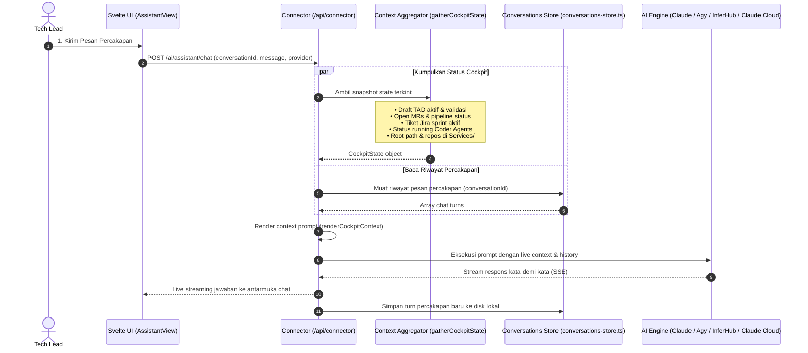

# Harness: AI Assistant & Cockpit Context Engine

Modul ini mendokumentasikan fitur **AI Assistant & Cockpit Context Engine**: asisten percakapan cerdas untuk Tech Lead yang memiliki *state awareness* mendalam terhadap seluruh konteks aktif aplikasi (draft TAD, open MR, tiket Jira, status agent, codebase services), persistensi sesi multi-turn, serta integrasi Claude Cloud dan mode Ultrareview.

---

## 🎯 Ringkasan & Alur Kerja Fitur

Tidak seperti chatbot umum yang tidak mengetahui konteks proyek, AI Assistant di Tech Lead Cockpit secara otomatis mengumpulkan status runtime aplikasi dan menyajikannya sebagai sistem pengetahuan (*system prompt injection*):



---

## 📂 Peta File Source Code (AI Assistant Module)

### Frontend (`src/assistant/` & `src/lib/assistant/`)
| File Path | Komponen | Deskripsi & Tanggung Jawab |
|---|---|---|
| [`src/assistant/AssistantView.svelte`](file:///Users/ridwan/mine/tech-lead-cockpit/src/assistant/AssistantView.svelte) | Tampilan Chat Assistant | Antarmuka interaksi chat: daftar sesi percakapan di sidebar, chat thread viewer, picker model AI, streaming response visualizer, dan copy response. |
| [`src/lib/assistant/conversations.ts`](file:///Users/ridwan/mine/tech-lead-cockpit/src/lib/assistant/conversations.ts) | Store Percakapan Frontend | State management percakapan aktif, pagination riwayat chat, dan pemanggilan API. |
| [`src/lib/assistant/types.ts`](file:///Users/ridwan/mine/tech-lead-cockpit/src/lib/assistant/types.ts) | Kontrak Tipe Assistant | Schema untuk `Conversation`, `ChatMessage`, `AssistantRole`, dan `AssistantChatRequest`. |
| [`src/lib/claude-cloud/client.ts`](file:///Users/ridwan/mine/tech-lead-cockpit/src/lib/claude-cloud/client.ts) | Claude Cloud Client | Client interaksi dengan session cloud Claude dan mode Ultrareview. |

### Backend Connector (`connector/`)
| File Path | Komponen | Deskripsi & Tanggung Jawab |
|---|---|---|
| [`connector/assistant.ts`](file:///Users/ridwan/mine/tech-lead-cockpit/connector/assistant.ts) | Chat Handler Backend | Memproses request chat, mengombinasikan histori dengan context render, memanggil AI provider, dan mengalirkan streaming output. |
| [`connector/cockpit-context.ts`](file:///Users/ridwan/mine/tech-lead-cockpit/connector/cockpit-context.ts) | Cockpit State Aggregator | Mengagregasi data real-time dari seluruh subsistem: `gatherCockpitState()` dan merendernya menjadi ringkasan markdown padat `renderCockpitContext()`. |
| [`connector/cockpit-knowledge.ts`](file:///Users/ridwan/mine/tech-lead-cockpit/connector/cockpit-knowledge.ts) | Knowledge Base Ingest | Menyediakan pemahaman dasar mengenai struktur internal microservice dan pola engineering tim. |
| [`connector/conversations-store.ts`](file:///Users/ridwan/mine/tech-lead-cockpit/connector/conversations-store.ts) | Persistensi Chat Lokal | Menyimpan percakapan ke file JSON di `DATA_DIR/conversations/<id>.json`. |
| [`connector/claude-cloud.ts`](file:///Users/ridwan/mine/tech-lead-cockpit/connector/claude-cloud.ts) | Driver Claude Cloud & Ultrareview | Mengelola sesi Claude Cloud CLI dan mode analisa mendalam *Ultrareview*. |

---

## 🧠 Anatomi Konteks Cockpit (Cockpit State Engine)

Fungsi `gatherCockpitState()` mengompilasi snapshot aplikasi tanpa membocorkan data sensitif:
- **TAD Drafts**: Draft ID, judul PRD/TAD, daftar service yang disentuh, dan jumlah issue validasi yang tersisa.
- **GitLab MRs**: Jumlah MR yang membutuhkan review dari user, judul, author, branch, dan pipeline status.
- **Jira Tickets**: Isu aktif yang di-assign ke user atau tim, status terkini, dan Acceptance Criteria ringkas.
- **Coder Runs**: Agent yang sedang aktif berjalan, task mana yang sedang dikerjakan, dan status test terakhir.
- **Services Directory**: Daftar repositori yang terdeteksi di folder `Services/` pengguna.

Informasi ini disematkan di awal instruksi sistem sehingga ketika Tech Lead bertanya: *"Apa blocker terbesar di sprint ini?"* atau *"Bagaimana status task pembayaran di TAD?"*, asisten dapat langsung menjawab secara presisi tanpa perlu input manual.

---

## 🛠️ Panduan Development & Debugging

### Menjalankan Unit Test Assistant & Context
```bash
npm test connector/assistant.test.ts
npm test connector/cockpit-context.test.ts
npm test connector/conversations-store.test.ts
```

> [!NOTE]
> Setelah melakukan perubahan pada modul AI Assistant, pastikan Anda memperbarui dokumen ini jika terdapat modifikasi struktur state context, endpoint chat, atau integrasi provider cloud!
