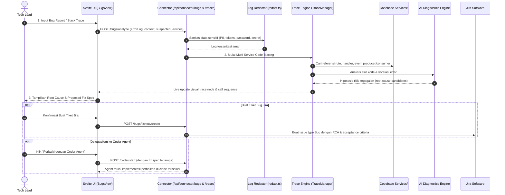

# Harness: Bug Tracing & Diagnosis

Modul ini mendokumentasikan fitur **Bug Tracing & Multi-Service Diagnostics**: ingestion laporan bug, sanitasi log/stack trace, penelusuran alur eksekusi kode lintas microservice, analisis akar masalah berbasis AI, pembuatan spesifikasi perbaikan (*fix spec*), serta pembuatan tiket bug Jira atau eskalasi ke Coder Agent.

---

## 🎯 Ringkasan & Alur Kerja Fitur

Penanganan bug pada sistem microservice terdistribusi sering kali memerlukan investigasi rantai panggilan (*call chain*) dari satu service ke service lainnya:



---

## 📂 Peta File Source Code (Bug Tracing Module)

### Frontend (`src/bugs/` & `src/lib/bugs/`)
| File Path | Komponen | Deskripsi & Tanggung Jawab |
|---|---|---|
| [`src/bugs/BugsView.svelte`](file:///Users/ridwan/mine/tech-lead-cockpit/src/bugs/BugsView.svelte) | Tampilan Utama Bug Tracing | Form input error/stack trace, riwayat investigasi bug, selector service terdampak, dan tampilan hasil analisis RCA. |
| [`src/bugs/BugTraceWatcher.svelte`](file:///Users/ridwan/mine/tech-lead-cockpit/src/bugs/BugTraceWatcher.svelte) | Background Trace Observer | Pengamat background yang memantau proses trace yang sedang berjalan dan memberikan notifikasi saat analisis selesai. |
| [`src/views/TraceResult.svelte`](file:///Users/ridwan/mine/tech-lead-cockpit/src/views/TraceResult.svelte) | Visualizer Alur Trace | Visualisasi langkah-langkah penelusuran kode, file yang dicurigai, dan snippet fungsi terkait. |
| [`src/lib/bugs/client.ts`](file:///Users/ridwan/mine/tech-lead-cockpit/src/lib/bugs/client.ts) | Bugs Client API | Client komunikasi ke endpoint `/api/connector/bugs/*`. |
| [`src/lib/trace/client.ts`](file:///Users/ridwan/mine/tech-lead-cockpit/src/lib/trace/client.ts) | Traces Client API | Client komunikasi ke endpoint `/api/connector/traces/*`. |
| [`src/lib/bugs/types.ts`](file:///Users/ridwan/mine/tech-lead-cockpit/src/lib/bugs/types.ts) | Kontrak Data Bug | Tipe data untuk `BugCaseInput`, `BugAnalyzeRequest`, `BugReport`, dan spesifikasi tiket bug. |

### Backend Connector (`connector/bugs/` & `connector/trace/`)
| File Path | Komponen | Deskripsi & Tanggung Jawab |
|---|---|---|
| [`connector/bugs/manager.ts`](file:///Users/ridwan/mine/tech-lead-cockpit/connector/bugs/manager.ts) | Bug Case Manager | Mengelola persistensi case investigasi bug di disk lokal, riwayat query, dan status analisis. |
| [`connector/bugs/redact.ts`](file:///Users/ridwan/mine/tech-lead-cockpit/connector/bugs/redact.ts) | Log & Trace Redactor | Regex engine untuk menyensor password, token otentikasi, bearer header, nomor KTP/NIK, nomor telepon, dan nomor kartu kredit sebelum dikirim ke AI. |
| [`connector/bugs/analysis.ts`](file:///Users/ridwan/mine/tech-lead-cockpit/connector/bugs/analysis.ts) | Bug RCA Engine | Merumuskan prompt investigasi mendalam, mengekstrak hipotesis penyebab utama (*root cause*), dan merumuskan spesifikasi perbaikan teknis. |
| [`connector/trace/manager.ts`](file:///Users/ridwan/mine/tech-lead-cockpit/connector/trace/manager.ts) | Trace Orchestrator | Mengorkestrasi navigasi pembacaan source code antarlayanan di folder `Services/` untuk mencari rantai eksekusi fungsi. |
| [`connector/trace/prompt.ts`](file:///Users/ridwan/mine/tech-lead-cockpit/connector/trace/prompt.ts) | Trace Prompt Builder | Menyusun instruksi prompt terstruktur untuk memandu LLM menelusuri alur kode secara efisien tanpa overload token. |
| [`connector/trace/verify.ts`](file:///Users/ridwan/mine/tech-lead-cockpit/connector/trace/verify.ts) | Trace Verifier | Memvalidasi keberadaan file, path, dan symbol kode yang dilaporkan oleh AI dalam codebase nyata. |

---

## 🛡️ Sanitasi & Proteksi Log (Redaction Rules)

Sebelum error log atau stack trace diserahkan ke AI engine, [`connector/bugs/redact.ts`](file:///Users/ridwan/mine/tech-lead-cockpit/connector/bugs/redact.ts) secara otomatis menerapkan pola sensor:
- Header Authorization / Bearer token: diganti dengan `[REDACTED_TOKEN]`.
- Password, secret, apiKey, access_token: nilai field disensor menjadi `[REDACTED_SECRET]`.
- Nomor kartu kredit (Luhn candidate): disensor menjadi `[REDACTED_CC]`.
- Nomor identitas (NIK / KTP) & nomor HP: disensor sesuai pola numerik Indonesia.
- Endpoint URL berparameter rahasia: query string sensitif disanitasi.

---

## 🛠️ Panduan Development & Debugging

### Menguji Engine Sanitasi Log
Pastikan aturan redaksi tidak merusak konteks teknis error:
```bash
npm test connector/bugs/redact.test.ts
```

### Menjalankan Test Integrasi Trace Manager
```bash
npm test connector/trace/trace.test.ts
npm test connector/bugs/bugs.test.ts
```

> [!NOTE]
> Setelah melakukan perubahan pada modul Bug Tracing, pastikan Anda memperbarui dokumen ini jika terdapat modifikasi pola sanitasi data, interface analysis, atau alur eskalasi tiket!
