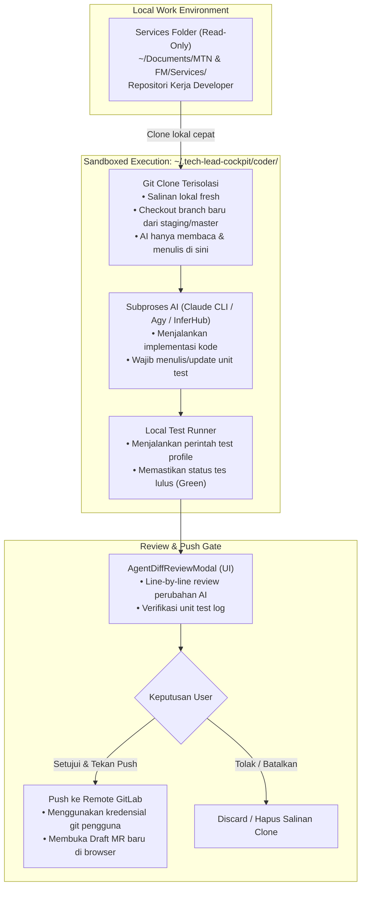

# Harness: Coder Agents & Local Task Runs

Modul ini mendokumentasikan fitur **Coder Agents & Agent Tasks**: eksekusi agen pengkodean otonom lokal yang mengimplementasikan task-task arsitektur dari TAD langsung ke repositori microservice secara terisolasi dan aman.

---

## 🎯 Ringkasan & Filosofi Keamanan (Guardrails)

Fitur Coder Agent dibangun dengan filosofi keamanan yang sangat ketat: **AI tidak pernah diberikan akses langsung untuk mengubah repositori kerja utama pengguna tanpa isolasi dan review manual.**



---

## 📂 Peta File Source Code (Coder Agents Module)

### Frontend (`src/coder/`, `src/views/`, `src/lib/coder/`)
| File Path | Komponen | Deskripsi & Tanggung Jawab |
|---|---|---|
| [`src/views/AgentTasksView.svelte`](file:///Users/ridwan/mine/tech-lead-cockpit/src/views/AgentTasksView.svelte) | Halaman Agent Tasks | Dashboard sentral seluruh run coding agent: status (`queued`, `running`, `completed`, `failed`), waktu eksekusi, tombol kontrol (Pause, Cancel, Review). |
| [`src/coder/AgentRunsPanel.svelte`](file:///Users/ridwan/mine/tech-lead-cockpit/src/coder/AgentRunsPanel.svelte) | Panel Antrean Agent | Menampilkan task-task yang sedang berjalan atau antre untuk dieksekusi secara paralel berdasarkan batas konkurensi. |
| [`src/coder/StartAgentsDialog.svelte`](file:///Users/ridwan/mine/tech-lead-cockpit/src/coder/StartAgentsDialog.svelte) | Dialog Peluncuran Agent | Modal untuk memilih task dari TAD, memetakan repositori target, memilih profil (Backend/Frontend), dan menentukan base branch. |
| [`src/coder/AgentDiffReviewModal.svelte`](file:///Users/ridwan/mine/tech-lead-cockpit/src/coder/AgentDiffReviewModal.svelte) | Modal Review Diff | Menampilkan perbandingan diff lengkap dari hasil kerja agent sebelum diizinkan push ke GitLab. |
| [`src/coder/TadFlowUnitTestModal.svelte`](file:///Users/ridwan/mine/tech-lead-cockpit/src/coder/TadFlowUnitTestModal.svelte) | Modal Verifikasi Test | Memeriksa apakah alur teknis (flow) yang dispesifikasikan pada TAD telah dipetakan menjadi unit test oleh agent. |
| [`src/components/AgentTaskLogViewer.svelte`](file:///Users/ridwan/mine/tech-lead-cockpit/src/components/AgentTaskLogViewer.svelte) | Streaming Log Viewer | Komponen visualizer log ANSI terminal real-time untuk memantau aktivitas proses agent. |
| [`src/lib/coder/client.ts`](file:///Users/ridwan/mine/tech-lead-cockpit/src/lib/coder/client.ts) | Coder Frontend Client | Penghubung API fetch ke rute `/api/connector/coder/*`. |
| [`src/lib/coder/types.ts`](file:///Users/ridwan/mine/tech-lead-cockpit/src/lib/coder/types.ts) | Definisi Tipe Coder | Interface untuk `CoderRun`, `CoderProfile`, `CoderRunEvent`, `CoderSettings`, dan payload request. |

### Backend Connector (`connector/`)
| File Path | Komponen | Deskripsi & Tanggung Jawab |
|---|---|---|
| [`connector/coder-runs.ts`](file:///Users/ridwan/mine/tech-lead-cockpit/connector/coder-runs.ts) | Core Coder Engine | Mengatur siklus hidup run agent, kloning git terisolasi, eksekusi AI subprocess, pembatasan konkurensi (default 2 run simultan), pengujian otomatis, dan push git. |
| [`connector/agent-tasks.ts`](file:///Users/ridwan/mine/tech-lead-cockpit/connector/agent-tasks.ts) | Agent Task Store | Sinkronisasi dan persistensi state tugas agent lokal ke memori dan disk. |
| [`connector/coder-agent-sync.ts`](file:///Users/ridwan/mine/tech-lead-cockpit/connector/coder-agent-sync.ts) | Event Synchronizer | Menghubungkan event dari `coder-runs` ke antarmuka `agentRuntime`. |
| [`connector/openai-tool-runner.ts`](file:///Users/ridwan/mine/tech-lead-cockpit/connector/openai-tool-runner.ts) | OpenAI Function Tool Runner | Adapter pemanggilan tool eksekusi (read file, edit file, run test) untuk model berbasis OpenAI API. |

---

## 🛡️ Aturan & Profil Standar (Default Profiles)

Diatur dalam [`connector/coder-runs.ts`](file:///Users/ridwan/mine/tech-lead-cockpit/connector/coder-runs.ts):

### 1. Profil Backend (`backend`)
- **Fokus**: Route, handler, service, repository, format response, dan error handling standar.
- **Mandatori Unit Test**: Wajib menulis atau memperbarui unit test yang memetakan flow TAD (validasi payload, happy path, kondisi branching/reject, fallback error dengan mock).
- **Larangan Keras**: Dilarang membuat/mengubah file `.env`, credential, konfigurasi deployment, atau migrasi yang berpotensi menghapus data produksi.

### 2. Profil Frontend (`frontend`)
- **Fokus**: Komponen UI, reusable styling, validasi formulir, penanganan state, dan konsumsi API.
- **Mandatori Unit Test / Lint**: Wajib menjalankan lint dan test komponen untuk memastikan form validation teruji.
- **Larangan Keras**: Dilarang menambah dependency/library baru tanpa alasan mendesak, dilarang merombak konfigurasi bundler/build tool.

---

## 🔄 Siklus Hidup Tugas Agent (Run Lifecycle)

```text
[QUEUED]
   │
   ▼
[RUNNING] ──(Kloning repo -> Setup branch -> AI Coding -> Run Test)
   │
   ├─► Jika test gagal atau error ──► [FAILED]
   │
   ├─► Jika di-pause/cancel oleh user ──► [PAUSED / CANCELLED]
   │
   ▼
[COMPLETED] ──(Menunggu Review User di AgentDiffReviewModal)
   │
   ├─► User Approve & Push ──► Push branch ke GitLab & Buat Draft MR
   │
   └─► User Reject ──► Hapus salinan clone di ~/.tech-lead-cockpit/coder/
```

---

## 🛠️ Panduan Development & Debugging

### Mengubah Konfigurasi Concurrency
Secara default, aplikasi membatasi `concurrency: 2` agar CPU laptop tidak terbebani secara berlebihan. Pengaturan dapat diubah melalui endpoint `POST /api/connector/coder/settings` atau melalui UI Pengaturan.

### Menambahkan Profil Baru
1. Buka [`connector/coder-runs.ts`](file:///Users/ridwan/mine/tech-lead-cockpit/connector/coder-runs.ts).
2. Tambahkan entri pada objek `DEFAULT_PROFILES`:
   ```typescript
   mobile: {
     id: 'mobile',
     label: 'Mobile (Flutter / React Native)',
     ai: { provider: 'claude', model: 'sonnet' },
     instructions: '...',
   }
   ```
3. Tambahkan profil ID baru ke `CoderProfileId` di [`src/lib/coder/types.ts`](file:///Users/ridwan/mine/tech-lead-cockpit/src/lib/coder/types.ts).
4. Jalankan unit test:
   ```bash
   npm test connector/coder-runs.test.ts
   ```
