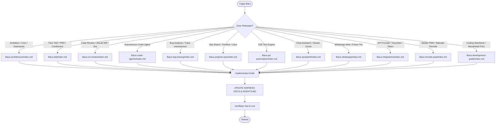

# Tech Lead Cockpit — Master Harness Index

Selamat datang di sistem dokumentasi dan development harness **Tech Lead Cockpit**. Harness ini dirancang sebagai *source of truth* operasional, arsitektural, dan panduan teknis bagi setiap AI Agent dan pengembang yang bekerja pada repositori ini.

---

## ⚡ Golden Rule for AI Agents & Developers

> [!CRITICAL]
> ### KEWAJIBAN SINKRONISASI HARNESS (MANDATORY HARNESS UPDATE)
> **Setiap kali Anda menambah, memodifikasi, merombak (refactor), atau menghapus fitur/kode di repositori ini, Anda WAJIB meng-update file harness yang bersesuaian di bawah `docs/harness/` serta memperbarui referensi di `AGENTS.md` sebelum menyelesaikan tugas.**
> 
> Tidak ada kode yang dianggap *selesai* (definition of done) jika harness-nya belum disinkronkan dengan perubahan aktual!
> 
> Baca panduan protokol sinkronisasi di [docs/harness/development-guide/index.md](development-guide/index.md#harness-synchronization-protocol).

---

## 🧭 Peta Modul Harness (Quick Navigation)

Setiap direktori modul di dalam `docs/harness/` dilengkapi dengan `index.md` mandiri yang menguraikan deskripsi fitur, cara kerja teknis, data flow, struktur file, API endpoint, serta panduan development:

| Modul Harness | Deskripsi & Cakupan Fitur | Dokumen Index | File Utama Source Code |
|---|---|---|---|
| **System Architecture** | Arsitektur Desktop Tauri v2, Svelte 5 Runes, Node 22 ESM Sidecar, OS Keychain, dan batas keamanan. | [architecture/index.md](architecture/index.md) | `src-tauri/src/lib.rs`, `connector/dev-connector.ts`, `src/lib/api-base.ts` |
| **TAD Workspace** | PRD ingest, AI TAD generator (Claude/Agy/InferHub/9Router), revisi & line diff rollback, validator format, Confluence storage publisher, Jira tickets generator. | [tad/index.md](tad/index.md) | `src/tad/*`, `src/lib/tad/*`, `connector/generator-*.ts`, `connector/tad-tickets.ts` |
| **MR Review** | GitLab MR-first review, change-to-task detection dengan evidence, Jira context panel, TAD conformance check, manual MR links. | [mr-review/index.md](mr-review/index.md) | `src/mr/*`, `src/lib/gitlab/*`, `connector/gitlab.ts`, `connector/git-review.ts` |
| **Coder Agents** | Eksekusi autonomous coding agent lokal, isolasi workspace di `~/.tech-lead-cockpit/coder/`, review diff, unit test runner, guardrails anti-leak. | [coder-agents/index.md](coder-agents/index.md) | `src/coder/*`, `src/views/AgentTasksView.svelte`, `connector/coder-runs.ts`, `connector/agent-tasks.ts` |
| **Bug Tracing** | Pelacakan error lintas microservice, log redaction, diagnosa akar masalah AI, pembuatan fix spec & tiket Jira bug, background watcher. | [bug-tracing/index.md](bug-tracing/index.md) | `src/bugs/*`, `src/lib/bugs/*`, `connector/bugs/*`, `connector/trace/*` |
| **Projects & Ops** | Ops Board, pelacakan progres proyek, pencegahan regresi (task peaks), kalkulasi estimasi jadwal (libur nasional Indonesia), scheduled VPS reporter. | [projects-ops/index.md](projects-ops/index.md) | `src/projects/*`, `src/lib/projects/*`, `connector/estimate/*`, `reporter/tad-progress.ts` |
| **QA Automation** | Generator & runner automation test E2E, manajemen environment (staging/dev), eksekusi flow berbasis AI. | [qa-automation/index.md](qa-automation/index.md) | `connector/qa/*`, `src/lib/qa/*`, `src/projects/E2EPanel.svelte` |
| **AI Assistant** | Asisten Tech Lead multi-turn, Cockpit Context Engine (injeksi state aktif ke AI), persistent conversations, Claude Cloud & Ultrareview. | [assistant/index.md](assistant/index.md) | `src/assistant/*`, `src/lib/assistant/*`, `connector/assistant.ts`, `connector/cockpit-context.ts` |
| **WhatsApp Bridge** | Jembatan WhatsApp Web (Baileys), QR authentication, draft balasan AI berbasis persona/audiens, template, safety rate-limiting & konfirmasi manual. | [whatsapp/index.md](whatsapp/index.md) | `src/whatsapp/*`, `src/lib/whatsapp/*`, `connector/whatsapp/*` |
| **Integrations** | Driver integrasi Atlassian Jira, Confluence, GitLab, Microsoft Teams, AI Providers (Claude CLI, Agy, InferHub, 9Router), dan macOS Keychain. | [integrations/index.md](integrations/index.md) | `connector/jira.ts`, `connector/confluence.ts`, `connector/gitlab.ts`, `connector/ai-providers.ts`, `connector/keychain.ts` |
| **Remote Access PWA** | Companion PWA untuk HP via Tailscale / LAN, bundled assets, PIN-based pairing, monitoring task & TAD approval. | [remote-pwa/index.md](remote-pwa/index.md) | `connector/remote/*`, `src/lib/remote/*`, `src/components/RemoteAccessModal.svelte` |
| **Development Guide** | Standar Svelte 5 Runes, konvensi pembuatan endpoint Connector, penulisan test (Vitest), tata cara refactoring, dan protokol update harness. | [development-guide/index.md](development-guide/index.md) | `package.json`, `vite.config.ts`, `tsconfig.json` |

---

## 🎯 Quick Matrix: "Saya Ingin Bekerja Pada..."

Gunakan matriks ini saat menerima instruksi spesifik untuk langsung melompat ke panduan yang tepat:

---

## 🔒 Security & Privacy Guardrails Ringkas

1. **Strict Zero .env Reading**: Dilarang keras membaca, menampilkan, atau memproses file `.env`, `.env.*`, atau file credential/kunci privat (`*.pem`, `*.key`, `id_rsa*`).
2. **Keychain First**: Semua token (GitLab, Jira, Confluence, InferHub, 9Router) disimpan di macOS Keychain via `/usr/bin/security`. Frontend TIDAK PERNAH menerima raw token.
3. **No Secret Persistence in LocalStorage**: LocalStorage hanya untuk preferensi UI non-sensitif (filter, tema, ID draft aktif).
4. **Isolated Agent Execution**: Coding agents bekerja di salinan terisolasi (`~/.tech-lead-cockpit/coder/<run>`), membaca codebase lokal tanpa pernah menulis langsung ke repositori kerja pengguna tanpa konfirmasi.
5. **Human-in-the-Loop Confirmation**: Tindakan eksternal berdampak (Publish Confluence, Jira Transition, Push Git Branch, Send WhatsApp Message) SELALU membutuhkan konfirmasi eksplisit dari pengguna.
