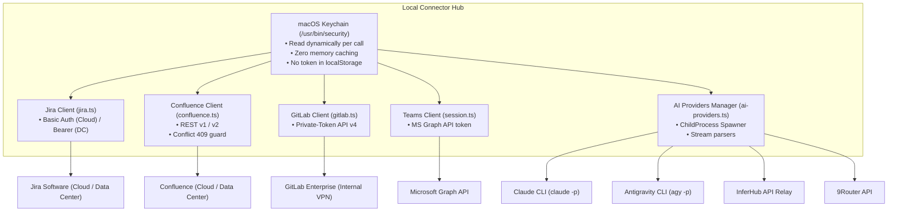

# Harness: External Integrations & AI Providers

Modul ini mendokumentasikan seluruh adapter integrasi eksternal di **Tech Lead Cockpit**: Atlassian Jira, Confluence, GitLab, Microsoft Teams, AI Provider Drivers (Claude CLI, Antigravity CLI, InferHub, 9Router), dan macOS Keychain adapter.

---

## 🎯 Ringkasan & Arsitektur Provider

Semua integrasi eksternal dijalankan secara lokal melalui proses Connector. Kredensial rahasia (token) dibaca secara dinamis dari **macOS Keychain** sesaat sebelum panggilan HTTP dilakukan, sehingga browser/UI tidak pernah memegang token mentah:



---

## 📂 Peta File Source Code (Integrations Module)

### Integrasi Atlassian (Jira & Confluence)
| File Path | Komponen | Deskripsi & Tanggung Jawab |
|---|---|---|
| [`connector/jira.ts`](file:///Users/ridwan/mine/tech-lead-cockpit/connector/jira.ts) | Jira API Client | Mendukung Jira Cloud (Basic Auth + email + API token) dan Jira Data Center (Personal Access Token). Mengambil detail issue, status, transitions, pencarian via JQL, dan pembuatan batch tiket. |
| [`connector/confluence.ts`](file:///Users/ridwan/mine/tech-lead-cockpit/connector/confluence.ts) | Confluence API Client | Mendukung Confluence Cloud dan Server/DC. Fetch halaman, pencarian space, pembuatan halaman baru, pembaruan konten, upload attachment diagram PNG, dan proteksi konflik versi (HTTP 409). |
| [`src/lib/jira/client.ts`](file:///Users/ridwan/mine/tech-lead-cockpit/src/lib/jira/client.ts) | Jira Frontend Bridge | Client komunikasi UI ke endpoint `/api/connector/jira/*`. |
| [`src/lib/confluence/client.ts`](file:///Users/ridwan/mine/tech-lead-cockpit/src/lib/confluence/client.ts) | Confluence Frontend Bridge | Client komunikasi UI ke endpoint `/api/connector/confluence/*`. |

### Integrasi GitLab & Microsoft Teams
| File Path | Komponen | Deskripsi & Tanggung Jawab |
|---|---|---|
| [`connector/gitlab.ts`](file:///Users/ridwan/mine/tech-lead-cockpit/connector/gitlab.ts) | GitLab API Client | Client REST API v4 GitLab: MR list, MR detail, commits, changed files, pipeline status, dan pembuatan review discussion. |
| [`connector/teams/session.ts`](file:///Users/ridwan/mine/tech-lead-cockpit/connector/teams/session.ts) | MS Teams Session Manager | Mengelola autentikasi Microsoft Graph API, pembacaan user profile, dan sinkronisasi Teams channels. |
| [`src/lib/teams/client.ts`](file:///Users/ridwan/mine/tech-lead-cockpit/src/lib/teams/client.ts) | Teams Frontend Bridge | Client komunikasi UI ke endpoint `/api/connector/teams/*`. |

### AI Inference Providers & Keychain
| File Path | Komponen | Deskripsi & Tanggung Jawab |
|---|---|---|
| [`connector/ai-providers.ts`](file:///Users/ridwan/mine/tech-lead-cockpit/connector/ai-providers.ts) | AI Drivers Manager | Mendeteksi binary `claude` dan `agy` di sistem, memvalidasi versi CLI, membaca daftar model, memicu child process streaming NDJSON, dan mengelola pembatalan (*cancel*). |
| [`connector/inferhub.ts`](file:///Users/ridwan/mine/tech-lead-cockpit/connector/inferhub.ts) | InferHub Driver | Menghubungkan Cockpit ke gateway InferHub (streaming model frontier seperti Claude 3.7 Sonnet, GPT-4o, DeepSeek, dsb.). |
| [`connector/ninerouter.ts`](file:///Users/ridwan/mine/tech-lead-cockpit/connector/ninerouter.ts) | 9Router Driver | Integrasi ke model gateway 9Router dengan streaming protokol seragam. |
| [`connector/keychain.ts`](file:///Users/ridwan/mine/tech-lead-cockpit/connector/keychain.ts) | macOS Keychain Adapter | Fungsi `readKeychain()`, `writeKeychain()`, dan `deleteKeychain()` yang membungkus CLI `/usr/bin/security`. |

---

## 🔑 Manajemen Token & Skrip Bantuan

Penyimpanan token ke Keychain dapat dilakukan langsung dari menu **Koneksi** di antarmuka aplikasi atau melalui skrip terminal:

```bash
npm run token:confluence  # Simpan token Confluence ke Keychain
npm run token:jira        # Simpan token Jira ke Keychain
npm run token:gitlab      # Simpan token GitLab ke Keychain
npm run token:inferhub    # Simpan API key InferHub ke Keychain
npm run token:9router     # Simpan API key 9Router ke Keychain
```

> [!WARNING]
> Jangan pernah menulis token API langsung ke dalam file kode atau meng-commit file `.env`! Semua token wajib masuk ke OS Keychain.

---

## 🛠️ Panduan Development & Debugging

### Menjalankan Test Integrasi Provider
```bash
npm test connector/jira.test.ts
npm test connector/confluence.test.ts
npm test connector/gitlab.test.ts
npm test connector/ai-providers.test.ts
npm test connector/inferhub.test.ts
npm test connector/ninerouter.test.ts
```

> [!NOTE]
> Setelah melakukan perubahan pada modul Integrasi, pastikan Anda memperbarui dokumen ini jika terdapat penambahan provider baru, perubahan header autentikasi, atau skema keychain!
