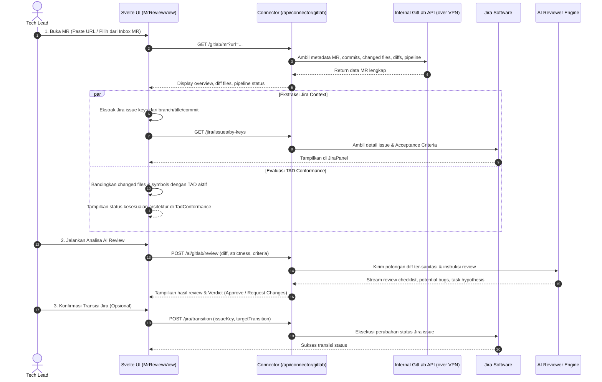

# Harness: GitLab MR Review & Jira Automation

Modul ini mendokumentasikan fitur **GitLab MR Review**: antarmuka code review desktop-first, ekstraksi diff & changed files dari GitLab internal via VPN laptop, deteksi perubahan-ke-task (Change-to-Task Detection) dengan bukti (*evidence*), integrasi tiket Jira berdampingan, evaluasi kepatuhan terhadap TAD (TAD Conformance), serta rekomendasi transisi status Jira.

---

## 🎯 Ringkasan & Alur Kerja Fitur

Workflow MR Review berfokus pada efisiensi Tech Lead dalam meninjau Merge Request tanpa memindahkan kode ke server cloud publik:



---

## 📂 Peta File Source Code (MR Review Module)

### Frontend (`src/mr/` & `src/lib/gitlab/`)
| File Path | Komponen | Deskripsi & Tanggung Jawab |
|---|---|---|
| [`src/mr/MrReviewView.svelte`](file:///Users/ridwan/mine/tech-lead-cockpit/src/mr/MrReviewView.svelte) | Main MR Review View | Komponen utama tampilan MR: tab navigasi (Overview, Files, Commits, AI Review, TAD Conformance), filter pencarian MR, recent MR list, dan kontrol diff. |
| [`src/mr/DiffFile.svelte`](file:///Users/ridwan/mine/tech-lead-cockpit/src/mr/DiffFile.svelte) | File Diff Viewer | Merender diff kode per file (tambah, hapus, modifikasi) dengan sintaks line-numbering, fold/unfold hunks, dan visual highlight. |
| [`src/mr/JiraPanel.svelte`](file:///Users/ridwan/mine/tech-lead-cockpit/src/mr/JiraPanel.svelte) | Jira Context Sidebar | Menampilkan tiket Jira yang terdeteksi dari branch atau judul MR: status tiket, assignee, deskripsi, dan Acceptance Criteria untuk perbandingan langsung dengan kode. |
| [`src/mr/TadConformance.svelte`](file:///Users/ridwan/mine/tech-lead-cockpit/src/mr/TadConformance.svelte) | Pemeriksa Kepatuhan TAD | Memvalidasi apakah file yang diubah pada MR sesuai dengan batasan scope yang telah ditetapkan pada dokumen TAD terkait. |
| [`src/lib/gitlab/client.ts`](file:///Users/ridwan/mine/tech-lead-cockpit/src/lib/gitlab/client.ts) | GitLab Frontend Client | Wrapper komunikasi fetch dari browser ke backend Connector `/api/connector/gitlab/*`. |
| [`src/lib/gitlab/types.ts`](file:///Users/ridwan/mine/tech-lead-cockpit/src/lib/gitlab/types.ts) | Tipe Data & Kontrak | Definisi TypeScript untuk `MrDetail`, `MrSummary`, `DiffFile`, `PipelineStatus`, `ReviewStrictness`, dan builder prompt review AI. |

### Backend Connector (`connector/`)
| File Path | Komponen | Deskripsi & Tanggung Jawab |
|---|---|---|
| [`connector/gitlab.ts`](file:///Users/ridwan/mine/tech-lead-cockpit/connector/gitlab.ts) | GitLab API Client | Client REST API GitLab v4: fetching MR list, parsing URL proyek, pagination diff, deteksi Jira issue key regex, dan penanganan timeout/retry. |
| [`connector/gitlab-manual.ts`](file:///Users/ridwan/mine/tech-lead-cockpit/connector/gitlab-manual.ts) | Manual MR Store | Penyimpanan mapping manual antara Jira key dan MR URL ketika auto-detection regex gagal mendeteksi issue key. |
| [`connector/git-review.ts`](file:///Users/ridwan/mine/tech-lead-cockpit/connector/git-review.ts) | Git Repo Resolver | Helper untuk menyelesaikan path repositori lokal di disk pengguna guna membaca konteks branch atau git history. |
| [`connector/jira-transition.ts`](file:///Users/ridwan/mine/tech-lead-cockpit/connector/jira-transition.ts) | Guarded Jira Transition | Mesin transisi Jira dengan validasi prasyarat (verifikasi `head_sha` MR, pemeriksaan status saat ini, pencocokan nama transisi aktual dari metadata Jira). |

---

## 🔍 Change-to-Task & Risk Detection

Algoritma review dan analisis perubahan menerapkan prinsip kehati-hatian (*safety-first*):

### Deteksi Area Berisiko Tinggi (High Risk Flags)
MR otomatis diberi tanda peringatan jika perubahannya menyentuh:
- **Autentikasi & Otorisasi**: File yang berkaitan dengan JWT, session, middleware auth, permissions, atau hashing.
- **Database & Migrasi**: Perubahan file skema SQL, migration scripts, atau query DDL.
- **Pembayaran & Finansial**: Service payment gateway, transaksi, ledgers, kalkulasi diskon.
- **Konfigurasi & Secret**: File konfigurasi runtime, docker-compose, atau template environment.
- **API Contract**: Route, proto files, OpenAPI specs, GraphQL schemas yang berpotensi menyebabkan *breaking changes*.
- **Ukuran Diff Ekstrem**: Perubahan lebih dari 500 baris atau menyentuh lebih dari 20 file.
- **Ketiadaan Test**: Perubahan pada kode produksi tanpa disertai penambahan/modifikasi unit test atau integration test.

### Standar Strictness AI Review
Tersedia tiga tingkatan ketelitian review ([`ReviewStrictness`](file:///Users/ridwan/mine/tech-lead-cockpit/src/lib/gitlab/types.ts)):
1. **Lax**: Fokus hanya pada syntax bugs fatal, breaking contract, dan vulnerability kritikal.
2. **Standard (Default)**: Memeriksa business logic edge cases, error handling, penamaan, struktur arsitektur, dan ketersediaan test.
3. **Strict**: Audit mendalam terhadap code style, potensi memory leak, performa query N+1, concurrency hazards, dan adherence penuh terhadap Acceptance Criteria.

---

## 🛠️ Panduan Development & Debugging

### Menguji GitLab Client Tanpa Jaringan Nyata
Gunakan fixture JSON untuk mensimulasikan respons GitLab di unit test:
```bash
npm test connector/gitlab.test.ts
```

### Menambah Parameter Review AI
1. Buka [`src/lib/gitlab/types.ts`](file:///Users/ridwan/mine/tech-lead-cockpit/src/lib/gitlab/types.ts).
2. Modifikasi fungsi `buildMrReviewPrompt()` untuk menambahkan instruksi atau konteks domain baru.
3. Pastikan token batas diff (`MAX_AI_DIFF` = 150.000 karakter) tidak terlampaui agar tidak memicu truncation pada model LLM.
