# Harness: Projects, Ops Board & Effort Estimation

Modul ini mendokumentasikan fitur **Projects, Ops Board, Effort Estimation, & Scheduled Progress Reporting**: papan operasional task, pelacakan progres proyek, proteksi anti-regresi stage (*task peaks*), engine estimasi jadwal yang mempertimbangkan hari libur nasional Indonesia, serta integrasi reporting otomatis via cron VPS (Hermes).

---

## 🎯 Ringkasan & Alur Kerja Fitur

Tech Lead Cockpit menyediakan visualisasi holistik terkait beban kerja tim dan progres proyek:

```mermaid
graph TD
    subgraph "Manajemen Proyek & Ops"
        TadTasks["Task dari Dokumen TAD"] --> Board["Ops Board (src/projects/OpsBoard.svelte)<br/>• Kategorisasi Service<br/>• Status & Prioritas"]
        JiraIssues["Tiket Jira Live"] --> Board
        Board --> Peaks["Task Peak Tracker (task-peaks.ts)<br/>• Rekam stage terjauh per task<br/>• Proteksi penurunan status / anti-regresi"]
    end

    subgraph "Estimasi Jadwal & Kalender Kerja"
        EstimateReq["Request Estimasi Proyek"] --> EstManager["Estimate Manager (connector/estimate/manager.ts)"]
        Holidays["Daftar Libur Nasional ID (holidays.ts)"] --> ScheduleEngine["Schedule Engine (schedule.ts)<br/>• Hitung hari kerja efektif<br/>• Kalkulasi sprint & buffer waktu"]
        EstManager --> ScheduleEngine
        ScheduleEngine --> EstUI["Panel Estimasi (src/projects/EstimatePanel.svelte)"]
    end

    subgraph "Pelaporan Progres Terjadwal"
        Snapshot["Progress Snapshot (snapshot.ts)"] --> VPSUpload["Upload via SSH ke VPS (vps.ts)"]
        VPSUpload --> HermesCron["Hermes Cron Job (tad-progress.mjs)<br/>• Eksekusi terjadwal di VPS<br/>• Refresh live status Jira<br/>• Deliver ke WhatsApp Group Tim"]
    end
```



---

## 📂 Peta File Source Code (Projects & Ops Module)

### Frontend (`src/projects/` & `src/lib/projects/`)
| File Path | Komponen | Deskripsi & Tanggung Jawab |
|---|---|---|
| [`src/projects/ProjectsView.svelte`](file:///Users/ridwan/mine/tech-lead-cockpit/src/projects/ProjectsView.svelte) | Tampilan Sentral Proyek | Container navigasi tab antara Ops Board, Kartu Progres, Estimasi Timeline, dan Pengaturan Laporan Terjadwal. |
| [`src/projects/OpsBoard.svelte`](file:///Users/ridwan/mine/tech-lead-cockpit/src/projects/OpsBoard.svelte) | Papan Operasional | Board bergaya Kanban/list yang mengagregasikan task dari seluruh TAD dan tiket Jira aktif. |
| [`src/projects/ProjectProgressCard.svelte`](file:///Users/ridwan/mine/tech-lead-cockpit/src/projects/ProjectProgressCard.svelte) | Kartu Metrik Progres | Menampilkan persentase penyelesaian task, status backend/frontend, dan indikator blocker. |
| [`src/projects/EstimatePanel.svelte`](file:///Users/ridwan/mine/tech-lead-cockpit/src/projects/EstimatePanel.svelte) | Panel Estimasi Jadwal | Antarmuka interaktif kalkulasi durasi proyek: konfigurasi kapasitas tim, rasio buffer, dan tanggal mulai/selesai. |
| [`src/projects/HolidaysModal.svelte`](file:///Users/ridwan/mine/tech-lead-cockpit/src/projects/HolidaysModal.svelte) | Modal Kalender Libur | Menampilkan dan mengelola kalender libur nasional dan cuti bersama Indonesia yang memengaruhi hari kerja. |
| [`src/projects/ScheduledReportModal.svelte`](file:///Users/ridwan/mine/tech-lead-cockpit/src/projects/ScheduledReportModal.svelte) | Modal Konfigurasi Laporan | Pengaturan jadwal broadcast progres harian ke VPS (jam pengiriman, penerima WhatsApp/Teams). |
| [`src/lib/estimate/schedule.ts`](file:///Users/ridwan/mine/tech-lead-cockpit/src/lib/estimate/schedule.ts) | Algoritma Penjadwalan | Menghitung rentang tanggal mulai dan selesai berdasarkan story point/hari kerja tim, mengecualikan akhir pekan dan libur nasional. |
| [`src/lib/estimate/holidays.ts`](file:///Users/ridwan/mine/tech-lead-cockpit/src/lib/estimate/holidays.ts) | Kalender Libur Indonesia | Basis data libur nasional Indonesia, cuti bersama, dan fungsi validasi hari kerja (`isWorkday`). |

### Backend Connector & Standalone Reporter (`connector/` & `reporter/`)
| File Path | Komponen | Deskripsi & Tanggung Jawab |
|---|---|---|
| [`connector/estimate/manager.ts`](file:///Users/ridwan/mine/tech-lead-cockpit/connector/estimate/manager.ts) | Backend Estimate Manager | Menghubungkan kalkulasi estimasi dengan historical load di Jira dan AI-assisted story point sizing. |
| [`connector/estimate/jira-load.ts`](file:///Users/ridwan/mine/tech-lead-cockpit/connector/estimate/jira-load.ts) | Jira Workload Ingest | Mengambil beban kerja aktual developer dari Jira untuk menghitung ketersediaan tim (*capacity*). |
| [`connector/task-peaks.ts`](file:///Users/ridwan/mine/tech-lead-cockpit/connector/task-peaks.ts) | Task Peak Store | Persistensi `task-peaks.json`: mencatat titik kemajuan tertinggi yang pernah dicapai setiap task agar regresi status dapat diidentifikasi. |
| [`connector/report/vps.ts`](file:///Users/ridwan/mine/tech-lead-cockpit/connector/report/vps.ts) | SSH VPS Synchronizer | Mengirim snapshot kemajuan terkini ke VPS target melalui SSH/SCP tanpa mengekspos token internal. |
| [`reporter/tad-progress.ts`](file:///Users/ridwan/mine/tech-lead-cockpit/reporter/tad-progress.ts) | Standalone VPS Cron Reporter | Script Node 22 murni (`tad-progress.mjs`) yang dijalankan oleh Hermes di VPS untuk mengirim laporan berkala langsung ke WhatsApp grup. |

---

## 📅 Logika Kalender Kerja & Hari Libur Indonesia

Perhitungan estimasi pada [`src/lib/estimate/schedule.ts`](file:///Users/ridwan/mine/tech-lead-cockpit/src/lib/estimate/schedule.ts) memperhitungkan:
1. **Hari Kerja Standar**: Senin hingga Jumat (5 hari kerja per minggu).
2. **Libur Nasional & Cuti Bersama**: Terdaftar lengkap di [`src/lib/estimate/holidays.ts`](file:///Users/ridwan/mine/tech-lead-cockpit/src/lib/estimate/holidays.ts) (Idul Fitri, Tahun Baru, Kemerdekaan RI, Natal, dsb.).
3. **Faktor Buffer Risiko**: Pengali otomatis (default 1.15x - 1.25x) untuk mengantisipasi dependensi antar service, code review cycle, dan deployment overhead.

---

## 🛠️ Panduan Development & Debugging

### Menjalankan Test Jadwal & Kalender Libur
```bash
npm test src/lib/estimate/schedule.test.ts
npm test connector/estimate/estimate.test.ts
```

### Menguji Build Standalone Reporter VPS
```bash
npm run build:reporter
# Hasil bundle berada di dist-reporter/tad-progress.mjs
```

> [!NOTE]
> Setelah melakukan perubahan pada modul Projects & Ops, pastikan Anda memperbarui dokumen ini jika terdapat modifikasi struktur snapshot progres, skema estimasi jadwal, atau integrasi cron VPS!
