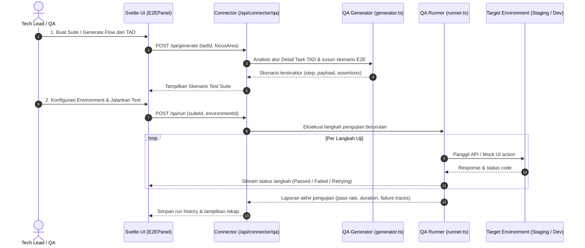

# Harness: QA Automation & E2E Test Engine

Modul ini mendokumentasikan fitur **QA Automation & E2E Testing**: generator skenario pengujian end-to-end berbasis spesifikasi TAD, manajemen environment (staging/dev), runner eksekusi otomatis, dan visualisasi hasil pengujian.

---

## 🎯 Ringkasan & Alur Kerja Fitur

QA Automation memudahkan verifikasi menyeluruh terhadap alur fitur lintas komponen:



---

## 📂 Peta File Source Code (QA Automation Module)

### Frontend (`src/projects/` & `src/lib/qa/`)
| File Path | Komponen | Deskripsi & Tanggung Jawab |
|---|---|---|
| [`src/projects/E2EPanel.svelte`](file:///Users/ridwan/mine/tech-lead-cockpit/src/projects/E2EPanel.svelte) | Panel Pengujian E2E | Antarmuka pembuatan test suite, daftar skenario uji, tombol run, dan ringkasan eksekusi test. |
| [`src/projects/E2EEnvironmentModal.svelte`](file:///Users/ridwan/mine/tech-lead-cockpit/src/projects/E2EEnvironmentModal.svelte) | Modal Manajemen Environment | Pengaturan URL base, auth token, dan mock variables untuk environment pengujian (Staging, Development, Local). |
| [`src/lib/qa/client.ts`](file:///Users/ridwan/mine/tech-lead-cockpit/src/lib/qa/client.ts) | QA API Client | Penghubung antarmuka UI dengan endpoint connector `/api/connector/qa/*`. |
| [`src/lib/qa/types.ts`](file:///Users/ridwan/mine/tech-lead-cockpit/src/lib/qa/types.ts) | Definisi Tipe Data QA | Schema untuk `QASuite`, `QAScenario`, `QAStep`, `QAEnvironment`, dan `QARunResult`. |

### Backend Connector (`connector/qa/`)
| File Path | Komponen | Deskripsi & Tanggung Jawab |
|---|---|---|
| [`connector/qa/manager.ts`](file:///Users/ridwan/mine/tech-lead-cockpit/connector/qa/manager.ts) | QA Suite Manager | Mengelola persistensi test suite, riwayat hasil pengujian, dan manajemen konfigurasi kredensial environment. |
| [`connector/qa/generator.ts`](file:///Users/ridwan/mine/tech-lead-cockpit/connector/qa/generator.ts) | AI Skenario Generator | Menganalisis dokumen arsitektur teknis untuk menghasilkan skenario pengujian realistis dengan validasi boundary & edge cases. |
| [`connector/qa/runner.ts`](file:///Users/ridwan/mine/tech-lead-cockpit/connector/qa/runner.ts) | Test Execution Engine | Mesin eksekutor HTTP requests, penegasan kondisi (*assertions*), logging error, dan penanganan timeout. |

---

## 🛠️ Panduan Development & Debugging

### Menjalankan Unit Test QA Engine
```bash
npm test connector/qa/qa.test.ts
```

> [!NOTE]
> Setelah melakukan perubahan pada modul QA Automation, pastikan Anda memperbarui dokumen ini jika terdapat modifikasi struktur schema skenario test atau runner API!
