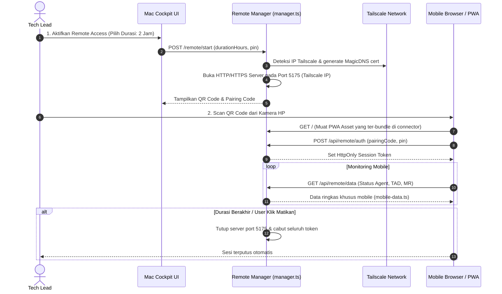

# Harness: Remote Access & Companion PWA

Modul ini mendokumentasikan fitur **Remote Access & Companion PWA**: pendamping mobile berbasis Progressive Web App (PWA) yang dapat diakses dari smartphone melalui jaringan pribadi Tailscale atau LAN lokal, memungkinkan Tech Lead memantau eksekusi agent dan menyetujui dokumen dari mana saja dengan aman.

---

## 🎯 Ringkasan & Prinsip Keamanan Jaringan

Remote Access dirancang dengan prinsip **Zero Persistent Exposure**:
- **Default Nonaktif**: Listener tidak pernah aktif secara otomatis dan status aktif tidak pernah disimpan secara persisten.
- **Tailscale Binding**: Listener diikat (*bound*) secara eksklusif ke alamat IP Tailscale Mac pengguna (`100.x.y.z`), bukan ke `0.0.0.0` publik.
- **Auto-Expire**: Setiap sesi memiliki batas waktu aktif (misal 1 jam, 4 jam) dan otomatis menutup diri begitu timer berakhir.
- **PIN & Token Pairing**: Akses dari perangkat mobile diverifikasi melalui QR code pairing dan PIN.



---

## 📂 Peta File Source Code (Remote PWA Module)

### Frontend Desktop & Mobile Assets
| File Path | Komponen | Deskripsi & Tanggung Jawab |
|---|---|---|
| [`src/components/RemoteIndicator.svelte`](file:///Users/ridwan/mine/tech-lead-cockpit/src/components/RemoteIndicator.svelte) | Indikator Status Header | Pill indikator di topbar yang menunjukkan apakah remote access aktif, waktu tersisa, dan tombol buka modal. |
| [`src/components/RemoteAccessModal.svelte`](file:///Users/ridwan/mine/tech-lead-cockpit/src/components/RemoteAccessModal.svelte) | Modal Kontrol Remote | Dialog desktop untuk mengaktifkan remote, memilih durasi, melihat QR pairing, dan memutus koneksi. |
| [`connector/remote/pwa/`](file:///Users/ridwan/mine/tech-lead-cockpit/connector/remote/pwa/) | Mobile PWA UI | Source code aplikasi web mobile (HTML, CSS, JS ringan tanpa framework berat) yang responsif untuk smartphone. |
| [`connector/remote/pwa-assets.ts`](file:///Users/ridwan/mine/tech-lead-cockpit/connector/remote/pwa-assets.ts) | Bundler Asset PWA | Membaca file-file PWA statis dan menanamkannya (*embed*) ke dalam bundle `server.mjs` saat build. |

### Backend Connector (`connector/remote/`)
| File Path | Komponen | Deskripsi & Tanggung Jawab |
|---|---|---|
| [`connector/remote/manager.ts`](file:///Users/ridwan/mine/tech-lead-cockpit/connector/remote/manager.ts) | Remote Access Lifecycle | Mengelola siklus hidup server port 5175, timer countdown, integrasi audit log, dan penutupan darurat. |
| [`connector/remote/tailscale.ts`](file:///Users/ridwan/mine/tech-lead-cockpit/connector/remote/tailscale.ts) | Tailscale Detector | Memeriksa apakah Tailscale CLI aktif, mendapatkan alamat IPv4 Tailscale, dan mengurus sertifikat TLS MagicDNS via `tailscale cert`. |
| [`connector/remote/auth.ts`](file:///Users/ridwan/mine/tech-lead-cockpit/connector/remote/auth.ts) | Mobile Auth Engine | Verifikasi kode pairing satu kali pakai, validasi PIN, pembuatan token sesi mobile, dan pembatasan percobaan gagal. |
| [`connector/remote/mobile-data.ts`](file:///Users/ridwan/mine/tech-lead-cockpit/connector/remote/mobile-data.ts) | Mobile Data Serializer | Menyaring data aplikasi menjadi payload ringkas yang hemat bandwidth untuk konsumsi smartphone. |
| [`connector/remote/routes.ts`](file:///Users/ridwan/mine/tech-lead-cockpit/connector/remote/routes.ts) | Router Endpoint Remote | Menangani rute API yang dipanggil dari desktop untuk mengontrol status remote. |
| [`connector/remote/server.ts`](file:///Users/ridwan/mine/tech-lead-cockpit/connector/remote/server.ts) | Dedicated Mobile Server | Server HTTP/HTTPS mandiri yang hanya merespons request dari IP Tailscale dan memvalidasi token mobile. |

---

## 🛠️ Panduan Development & Debugging

### Menjalankan Unit Test Remote Module
```bash
npm test connector/remote/remote.test.ts
npm test connector/remote/mobile-data.test.ts
```

> [!NOTE]
> Setelah melakukan perubahan pada modul Remote Access, pastikan Anda memperbarui dokumen ini jika terdapat modifikasi struktur asset PWA, port default, atau mekanisme otentikasi Tailscale!
