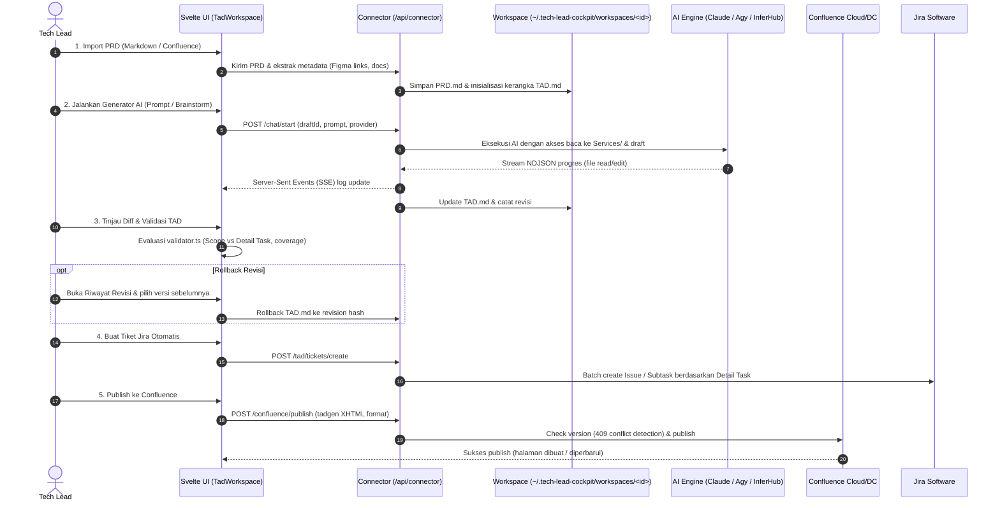

# Harness: TAD Workspace & Confluence Publisher

Modul ini mendokumentasikan fitur **Technical Architecture Document (TAD) Workspace**: parsing PRD, pembuatan TAD berbasis AI, validator skema arsitektur, manajemen revisi & rollback, konversi Confluence Storage Format (*tadgen style*), sinkronisasi 3-way merge, dan pembuatan tiket Jira otomatis.

---

## 🎯 Ringkasan & Alur Kerja Fitur

Workflow TAD dirancang untuk membawa Tech Lead dari dokumen PRD mentah menjadi dokumen arsitektur teknis siap publish dengan jaminan validitas tinggi:



---

## 📂 Peta File Source Code (TAD Module)

### Frontend (`src/tad/` & `src/lib/tad/`)
| File Path | Komponen | Deskripsi & Tanggung Jawab |
|---|---|---|
| [`src/tad/TadWorkspace.svelte`](file:///Users/ridwan/mine/tech-lead-cockpit/src/tad/TadWorkspace.svelte) | Workspace Shell | Tampilan utama TAD: mengelola draft aktif, tab editor (Markdown, Preview, Word View, Task Board, Proposal Review), status validasi, dan bar kontrol. |
| [`src/tad/ChatGeneratorPane.svelte`](file:///Users/ridwan/mine/tech-lead-cockpit/src/tad/ChatGeneratorPane.svelte) | Panel AI Generator | Antarmuka interaksi prompt dengan AI: pemilihan model, streaming aktivitas file yang dibaca/diedit, tombol cancel job, dan input instruksi. |
| [`src/tad/DraftSidebar.svelte`](file:///Users/ridwan/mine/tech-lead-cockpit/src/tad/DraftSidebar.svelte) | Sidebar Drafts | Daftar seluruh dokumen draft TAD lokal, pencarian draft, pembuatan draft baru, dan penghapusan draft. |
| [`src/tad/PreviewPane.svelte`](file:///Users/ridwan/mine/tech-lead-cockpit/src/tad/PreviewPane.svelte) | Preview Renderer | Merender preview TAD dengan Markdown parser, highlight code, styling tabel tadgen, dan diagram Mermaid live rendering. |
| [`src/tad/PublishDialog.svelte`](file:///Users/ridwan/mine/tech-lead-cockpit/src/tad/PublishDialog.svelte) | Dialog Publish | Modal publish ke Confluence: pemilihan Space, Parent Page, judul halaman, opsi Mermaid attachment, perbandingan versi, AI generator Catatan Versi (changelog), dan opsi sinkronisasi Change History dokumen. |
| [`src/tad/RevisionHistoryModal.svelte`](file:///Users/ridwan/mine/tech-lead-cockpit/src/tad/RevisionHistoryModal.svelte) | Riwayat Revisi | Modal untuk melihat riwayat snapshot revisi, komparasi visual line-by-line diff, dan tombol rollback instan. |
| [`src/tad/JiraTicketsDialog.svelte`](file:///Users/ridwan/mine/tech-lead-cockpit/src/tad/JiraTicketsDialog.svelte) | Generator Tiket Jira | Dialog untuk mengonfirmasi detail task hasil TAD yang akan di-push menjadi tiket Jira, estimasi story point, dan komponen. |
| [`src/tad/ConfluenceMergeModal.svelte`](file:///Users/ridwan/mine/tech-lead-cockpit/src/tad/ConfluenceMergeModal.svelte) | 3-Way Merge Dialog | Modal resolusi konflik jika versi halaman di Confluence berubah sejak draft dibuat (HTTP 409 conflict). |
| [`src/tad/WordEditor.svelte`](file:///Users/ridwan/mine/tech-lead-cockpit/src/tad/WordEditor.svelte) | Dual-Mode Editor | Editor dokumen TAD: Mode Dokumen Visual (Word WYSIWYG) dan Mode Kode Markdown, dilengkapi Ribbon Toolbar, Outline navigation, Find/Search, dan real-time `@mention` trigger. |
| [`src/tad/MentionPicker.svelte`](file:///Users/ridwan/mine/tech-lead-cockpit/src/tad/MentionPicker.svelte) | Autocomplete Mention | Popover saran pengguna Atlassian (@mention) dengan query Jira/Confluence API, filter kandidat lokal dokumen, keyboard navigation, dan floating caret positioning. |
| [`src/lib/tad/validator.ts`](file:///Users/ridwan/mine/tech-lead-cockpit/src/lib/tad/validator.ts) | Core Validator Engine | Memvalidasi integritas dokumen TAD: memastikan setiap item Scope memiliki Detail Task, mencocokkan requirement PRD, dan memeriksa sintaks nama task. |
| [`src/lib/tad/template.ts`](file:///Users/ridwan/mine/tech-lead-cockpit/src/lib/tad/template.ts) | Template & Section Schema | Mendefinisikan 15 section wajib standar TAD v1, regex parser section, dan skema nama task. |
| [`src/lib/confluence/storage.ts`](file:///Users/ridwan/mine/tech-lead-cockpit/src/lib/confluence/storage.ts) | Confluence Converter | Mengonversi Markdown TAD menjadi Confluence Storage Format (XHTML): Document Information (1800px), Detail Task 2-kolom (1688px), breakout code macro, Jira macro, serta konversi user mention spans ke `<ac:link><ri:user ri:account-id="..." /></ac:link>`. |
| [`src/lib/confluence/changelog.ts`](file:///Users/ridwan/mine/tech-lead-cockpit/src/lib/confluence/changelog.ts) | Changelog Helper | Fungsi pembantu manipulasi tabel Change History di dokumen Markdown (`appendChangeHistoryRow`). |

### Backend Connector (`connector/`)
| File Path | Komponen | Deskripsi & Tanggung Jawab |
|---|---|---|
| [`connector/confluence-changelog.ts`](file:///Users/ridwan/mine/tech-lead-cockpit/connector/confluence-changelog.ts) | AI Changelog Engine | Pembuat catatan versi otomatis berbasis diff target: ekstraksi section, ringkasan baris tambah/kurang, prompt builder, dan eksekusi provider AI. |
| [`connector/generator-jobs.ts`](file:///Users/ridwan/mine/tech-lead-cockpit/connector/generator-jobs.ts) | Job Manager Generator | Mengelola antrean dan status background job generator (`queued`, `running`, `completed`, `failed`), streaming event, serta proteksi concurrency per draft. |
| [`connector/generator-runner.ts`](file:///Users/ridwan/mine/tech-lead-cockpit/connector/generator-runner.ts) | Runner Eksekusi AI | Mempersiapkan direktori kerja `workspaces/<draftId>`, menyusun prompt, dan menjalankan provider AI (`claude`, `antigravity`, `inferhub`, `9router`). |
| [`connector/drafts-store.ts`](file:///Users/ridwan/mine/tech-lead-cockpit/connector/drafts-store.ts) | File Store Draft | Operasi I/O untuk file draft, metadata, riwayat commit revisi lokal, dan snapshot di bawah `DATA_DIR/workspaces/`. |
| [`connector/workspace-docs.ts`](file:///Users/ridwan/mine/tech-lead-cockpit/connector/workspace-docs.ts) | Attachment Manager | Mengelola file pendukung dalam subdirektori `docs/` pada draft (PDF, gambar layar Figma, spesifikasi partner). |
| [`connector/pdf-unlock.ts`](file:///Users/ridwan/mine/tech-lead-cockpit/connector/pdf-unlock.ts) | PDF Unlock Utility | Membuka kunci PDF yang dilindungi password (menggunakan qpdf) sebelum dianalisis oleh AI. |
| [`connector/tad-tickets.ts`](file:///Users/ridwan/mine/tech-lead-cockpit/connector/tad-tickets.ts) | Jira Ticket Bridge | Mengurai tabel Detail Task dari Markdown TAD dan memanggil Jira API untuk membuat batch tiket dan subtask. |

---

## 📐 Aturan Validasi TAD & Format Standar

Validator pada [`src/lib/tad/validator.ts`](file:///Users/ridwan/mine/tech-lead-cockpit/src/lib/tad/validator.ts) menerapkan aturan ketat:

1. **Section Wajib (TAD v1)**:
   - `Document Information`
   - `Change History`
   - `Objective`
   - `Documentation`
   - `Development Schema`
   - `Development Analysis`
   - `Development Scope`
   - `Detail Task`
   - `Rollout / Rollback Plan`
   - *(Dilarang meninggalkan teks placeholder seperti `TODO`, `TBD`, `<isi ...>`)*
2. **Sinkronisasi Scope ↔ Detail Task**:
   - Setiap entri task yang terdaftar di tabel **Development Scope** WAJIB memiliki section **Detail Task** yang bersesuaian.
   - Tidak boleh ada Detail Task tanpa entri di Development Scope (*orphan task*).
3. **Format Penamaan Task**:
   - Format: `[TYPE][SERVICE][CODENAME] - Nama Task`
   - Tipe yang valid: `BACKEND`, `MOBILE-FE`, atau `WEB-FE`.
4. **Coverage Requirement PRD**:
   - Setiap nomor requirement yang diparsing dari tabel requirement `PRD.md` harus dicakup oleh minimal satu task arsitektur.

---

## 🌐 Format Confluence Storage (*tadgen style*)

Fungsi `markdownToStorage()` di [`src/lib/confluence/storage.ts`](file:///Users/ridwan/mine/tech-lead-cockpit/src/lib/confluence/storage.ts) menghasilkan XHTML khusus yang kompatibel dengan Confluence Cloud dan Data Center:

- **Tabel Document Information**: Diberi style lebar `1800px` dengan colgroup dan highlight header abu-abu elegan.
- **Tabel Detail Task (kv_table)**: Format 2-kolom (Kunci & Nilai) selebar `1688px` untuk setiap task.
- **Code Macro**: Menggunakan `<ac:structured-macro ac:name="code">` dengan parameter `breakoutMode="wide"` agar snippet kode lebar tidak terpotong.
- **Jira Issue Keys**: Dikonversi otomatis menjadi `<ac:structured-macro ac:name="jira">` interaktif.
- **Mermaid Diagrams**: Dikonversi menjadi diagram PNG resolusi tinggi sebagai attachment halaman Confluence dan dibungkus dalam expand macro.
- **User Mentions**: Dikonversi menjadi `<ac:link><ri:user ri:account-id="accountId" /></ac:link>`.

---

## 👥 Sistem User Mentions (@mention) & Preservasi Confluence Import

### 1. Format Mention Standar
Sistem mendukung dan mempreservasi dua variasi format mention:
- **Format Cockpit**: `<span data-tlc-user="accountId">@DisplayName</span>`
- **Format Atlassian-CLI**: `<span class="confluence-user-mention" data-account-id="accountId">@DisplayName</span>`
- **Format Gabungan (Editor Insertion)**: `<span class="confluence-user-mention" data-account-id="accountId" data-tlc-user="accountId" contenteditable="false">@DisplayName</span>`

### 2. Autocomplete Interaktif & Penghapusan Atomik (`MentionPicker.svelte` & `WordEditor.svelte`)
- **Dual-Mode Editor Support**: Bekerja mulus baik di mode visual **Dokumen (Word WYSIWYG)** maupun **Mode Kode Markdown**.
- **Trigger Cepat Tanpa Lag**:
  - Pemeriksaan `@` instan dengan O(1) guard check sebelum regex.
  - Kandidat pengguna lokal dari dokumen langsung ditampilkan seketika (**0ms latency**) tanpa memblokir UI atau menunggu roundtrip jaringan.
  - Pencarian direktori remote Jira/Confluence hanya di-trigger setelah mengetik minimal 2 karakter (`q.length >= 2`) dengan debounce 250ms dan pembatalan request usang.
- **Kontras Warna Tinggi (High Contrast Design Tokens)**:
  - Popover autocomplete menggunakan token desain Cockpit (`--surface`, `--surface-2`, `--text`, `--text-2`, `--border-strong`, `--accent`), menjamin keterbacaan tajam pada tema Terang maupun Gelap.
  - Pill mention di lembar kerja Word (`.word-paper`) dan Preview (`.page`) mengunci warna Atlassian kontras tinggi (`color: #0052cc`, `background: #f4f5f7`, `border: 1px solid #dfe1e6`), mencegah pemudaran warna saat aplikasi berada dalam dark mode.
- **Penghapusan Atomik (Atomic Pill Deletion)**:
  - **Mode Word**: Menekan `Backspace` tepat di belakang pill (atau spasi pengikutnya) atau menekan `Delete` di depannya akan menghapus seluruh node pill secara atomik, tanpa meninggalkan sisa tag rusak atau teks tak terhapus. Seleksi yang memotong pill juga menghapusnya secara bersih.
  - **Mode Markdown**: Menekan `Backspace` tepat di belakang tag `<span ...>...</span>` mention akan menghapus seluruh string tag secara atomik, mencegah pemotongan karakter HTML sepotong-sepotong.
- **Navigasi Keyboard**: `ArrowUp` & `ArrowDown` untuk berpindah pilihan, `Enter` atau `Tab` untuk memilih, `Escape` untuk membatalkan.
- **Posisi Caret Adaptif**: Menghitung koordinat caret secara real-time via `getBoundingClientRect` (mode Word) atau reusable mirror positioning (mode Markdown), dengan proteksi boundary viewport agar tidak terpotong tepi layar.

### 3. Preservasi Penuh saat Import Confluence
- **Multi-Attribute & Local-ID Tolerance**: Parser `<ri:user>` pada [`connector/confluence.ts`](file:///Users/ridwan/mine/tech-lead-cockpit/connector/confluence.ts) dan [`src/lib/confluence/storage-to-markdown.ts`](file:///Users/ridwan/mine/tech-lead-cockpit/src/lib/confluence/storage-to-markdown.ts) tidak lagi mengasumsikan `ri:account-id` sebagai atribut pertama. Format Atlassian Cloud modern yang meletakkan `ri:local-id` di depan (e.g. `<ri:user ri:local-id="..." ri:account-id="..." />`) atau memakai `ri:userkey` dan `ri:username` di-parse dengan toleransi penuh.
- **Link Body & CDATA Extraction**: Jika Confluence XHTML memuat display name pada `<ac:plain-text-link-body><![CDATA[@Nama]]></ac:plain-text-link-body>` atau `<ac:link-body>`, nama tersebut diekstraksi langsung secara offline tanpa pemborosan request jaringan.
- **Jira Directory Fallback**: Jika Confluence Cloud me-masking profil pengguna atau endpoint `/rest/api/user` mengembalikan HTTP 403/404, connector otomatis mencoba fallback ke endpoint Jira `/rest/api/3/user?accountId=...` (`JiraClient.getUser()`).
- **Dukungan Format Tag Beragam**: Parser mengenali mention pada:
  - `<ac:link><ri:user ... /></ac:link>`
  - Bare `<ri:user ... />`
  - Tag HTML Confluence: `<span class="confluence-user-mention" ...>` dan `<a class="confluence-user-mention" ...>`
- **Uncapped Batching**: Pada [`connector/confluence.ts`](file:///Users/ridwan/mine/tech-lead-cockpit/connector/confluence.ts), batasan lama (`slice(0, 25)`) telah dihapus. Semua ID pengguna yang ditemukan pada halaman Confluence di-resolve dalam batch 20 pengguna tanpa ada yang dibuang atau diubah menjadi teks polos.
- **PublishDialog Auto-Mapping**: Fungsi `mentionedUsers()` pada [`src/tad/PublishDialog.svelte`](file:///Users/ridwan/mine/tech-lead-cockpit/src/tad/PublishDialog.svelte) membaca riwayat mention halaman Confluence target dengan regex multi-attribute independen, memastikan `@Nama` polos otomatis terikat ke account ID Confluence saat dipublish kembali.
- **Round-Trip Garansi**:
  - `Confluence XHTML` (`<ac:link><ri:user ri:account-id="..." />`) ➡️ `storageToMarkdown` ➡️ Markdown Span Mention (`<span data-tlc-user="accountId">@DisplayName</span>`).
  - Markdown Span Mention ➡️ `WordEditor` (ContentEditable) ➡️ `htmlToMarkdown` ➡️ Markdown.
  - Markdown ➡️ `toConfluenceStorage` ➡️ `Confluence XHTML` (`<ac:link><ri:user ri:account-id="..." /></ac:link>`).
  - Marked parser dan DOMPurify dikonfigurasi untuk mempertahankan tag `<span>` beserta atribut `data-tlc-user`, `data-account-id`, dan `contenteditable="false"`.

---

## 💾 Penyimpanan Draft Confluence (*Save as Draft*)

Fitur ini memungkinkan pengguna menyimpan perubahan TAD langsung ke Confluence sebagai **unpublished draft** tanpa menaikkan nomor versi publik halaman (`version.number` tetap dipertahankan), kompatibel dengan alur kerja `atlassian confluence draft`.

### 1. Dual-Action pada UI (`PublishDialog.svelte` & `TadWorkspace.svelte`)
- **Simpan sebagai Draft**: Mengirim `asDraft: true` pada `PublishRequest`.
  - Jika membuat halaman baru: membuat draft awal dengan `status: "draft"` pada versi 1.
  - Jika meng-update halaman (baik yang sudah berupa draft maupun published): mengirim `status: "draft"` dengan nomor versi tetap sama (`current.version`), sehingga versi publik Confluence tidak naik.
- **Publish Sekarang**: Mengirim `asDraft: false`.
  - Jika mempublikasikan draft aktif: mengubah `status: "current"` dengan nomor versi draft tersebut.
  - Jika meng-update halaman yang sudah terpublikasi: mengubah `status: "current"` dan menaikkan versi menjadi `current.version + 1`.
- **Indikator Visual**:
  - Badge target Confluence di header [`TadWorkspace.svelte`](file:///Users/ridwan/mine/tech-lead-cockpit/src/tad/TadWorkspace.svelte) menampilkan chip aksen `Confluence v{version} (Draft)`.
  - Tombol aksi utama berubah adaptif menjadi `Update / Publish Draft` ketika dokumen terikat ke draft Confluence.
  - Panel preview pada [`PublishDialog.svelte`](file:///Users/ridwan/mine/tech-lead-cockpit/src/tad/PublishDialog.svelte) menampilkan chip `Draft` dan keterangan `v{version} (draft aktif)`.

### 2. Kontrak API & Connector Backend
- **Endpoint**: `POST /api/connector/confluence/publish`
- **Request Payload (`PublishRequest`)**:
  ```ts
  export interface PublishRequest {
    spaceKey: string;
    title: string;
    storage: string;
    parentId?: string;
    pageId?: string;
    expectedVersion?: number;
    versionMessage?: string;
    attachments: AttachmentUpload[];
    context: { draftId: string; mrUrl?: string; jiraKeys?: string[] };
    asDraft?: boolean; // true = simpan draft tanpa naik versi
  }
  ```
- **Response Payload (`PublishResponse`)**:
  ```ts
  export interface PublishResponse {
    page: PageInfo;
    action: 'create' | 'update';
    isDraft?: boolean;
  }
  ```
- **Integrasi Confluence Cloud v2 & Data Center v1** ([`connector/confluence.ts`](file:///Users/ridwan/mine/tech-lead-cockpit/connector/confluence.ts)):
  - Cloud v2 (`PUT /api/v2/pages/{id}`): Mengirim payload `{ id, status: "draft", title, body, version: { number: currentVersion } }`.
  - DC v1 (`PUT /rest/api/content/{id}`): Mengirim payload `{ id, type: "page", status: "draft", title, version: { number: currentVersion }, body }`.
  - Fallback Pencarian & Get Page: [`getPage`](file:///Users/ridwan/mine/tech-lead-cockpit/connector/confluence.ts) dan [`findPage`](file:///Users/ridwan/mine/tech-lead-cockpit/connector/confluence.ts) memeriksa status `current` dan melakukan fallback pengecekan `status=draft` agar draft halaman yang belum terpublikasi tetap terdeteksi.
- **Audit Trail**: Audit event mencatat flag `isDraft` untuk transparansi riwayat aktivitas.

---

## 🤖 Catatan Versi AI (TAD Changelog) & Diff-Driven Summary

Fitur ini mengotomatiskan pembuatan **Catatan versi** (version comment / changelog) pada saat Tech Lead mempublikasikan atau meng-update halaman TAD ke Confluence. Catatan dihasilkan menggunakan model AI berdasarkan kalkulasi perbandingan (diff) antara draft aktif dan baseline halaman Confluence target.

### 1. Alur Kerja (Workflow)
```mermaid
flowchart TD
    Start([Klik 'Generate AI' pada Catatan Versi]) --> CheckPreflight{Target sudah dicek?}
    CheckPreflight -- Belum --> DoCheck[Otomatis jalankan check() / Cek Target]
    CheckPreflight -- Sudah --> CalculateDiff[Kalkulasi Perbandingan & Hunks]
    DoCheck --> CalculateDiff
    CalculateDiff --> Extract[Ekstrak Section Berubah & Cuplikan Diff]
    Extract --> API[POST /confluence/changelog]
    API --> AI[AI Engine: Susun 1-2 kalimat ringkas Tech Lead]
    AI --> FillInput[Isi input 'Catatan versi']
    FillInput --> SyncCheck{Centang 'Catat ke Change History'?}
    SyncCheck -- Ya --> AppendHistory[Tambahkan baris ke tabel Change History dokumen saat publish]
    SyncCheck -- Tidak --> Finish([Siap Publish / Simpan Draft])
    AppendHistory --> Finish
```

1. **Prioritas 'Cek Target Dulu'**:
   - Jika pengguna belum mengklik *Cek target* (`!preflightFresh`), menekan tombol **Generate AI** akan otomatis menjalankan `check()` terlebih dahulu untuk memverifikasi space, parent page, dan keberadaan halaman target di Confluence.
2. **Kalkulasi & Ekstraksi Diff**:
   - Mendeteksi section Markdown yang berubah dari daftar `hunks` (mis. `Development Scope`, `Detail Task: Backend`).
   - Mengambil cuplikan baris yang ditambah (`+`) dan dihapus (`-`) dari line-by-line diff.
3. **Penyusunan Catatan Versi oleh AI**:
   - AI (`generateConfluenceChangelog()`) menerima judul dokumen, flag halaman baru/update, daftar section yang terpengaruh, dan cuplikan diff.
   - Menghasilkan 1–2 kalimat padat (maksimal 200 karakter) dalam Bahasa Indonesia teknis profesional tanpa pembuka atau format berlebihan.
   - Jika dokumen baru, menghasilkan pesan inisiasi dokumen awal.
4. **Sinkronisasi Opsional ke Tabel 'Change History' Dokumen**:
   - Checkbox `Catat juga ke tabel Change History di dokumen` memungkinkan Tech Lead menyinkronkan catatan versi yang baru dibuat langsung ke tabel Change History di Markdown dokumen TAD (`appendChangeHistoryRow()`).
   - Format baris baru: `| <Catatan Versi> | <YYYY-MM-DD> | @<Author/Tech Lead> |`.
5. **Konfigurasi Model & Provider AI**:
   - Tepat di sebelah tombol `Generate AI`, terdapat badge indikator model (ikon bot) yang menampilkan AI aktif saat ini (mis. `claude`, `inferhub`, `9router`, dsb.).
   - Mengklik badge tersebut akan membuka panel dropdown `<AiPicker />` inline untuk mengganti provider atau model kapan saja.
   - Pilihan model secara default mewarisi preferensi AI generator TAD (`loadAiSelection('generator')`) dan disimpan ke `localStorage`.

### 2. Kontrak API & Endpoints
- **Endpoint**: `POST /api/connector/confluence/changelog`
- **Request (`ChangelogRequest`)**:
  ```ts
  export interface ChangelogRequest {
    title: string;
    isNewPage?: boolean;
    sectionsChanged?: string[];
    diffSnippet?: string;
    ai?: AiSelection;
  }
  ```
- **Response (`ChangelogResponse`)**:
  ```ts
  export interface ChangelogResponse {
    message: string;
  }
  ```
- **Client Helper**:
  ```ts
  connector.generateChangelog(req: ChangelogRequest): Promise<ChangelogResponse>
  ```

---

## 🛠️ Panduan Development & Ekstensi Fitur

### Menambah Section Baru pada Template TAD
1. Buka [`src/lib/tad/template.ts`](file:///Users/ridwan/mine/tech-lead-cockpit/src/lib/tad/template.ts) dan tambahkan section pada array `TAD_SECTIONS`.
2. Perbarui regex pattern atau matcher pada fungsi `findSection()`.
3. Buka [`src/lib/tad/validator.ts`](file:///Users/ridwan/mine/tech-lead-cockpit/src/lib/tad/validator.ts) dan pastikan issue code untuk section baru ditangani.
4. Jalankan unit test validator:
   ```bash
   npm test src/lib/tad/validator.test.ts
   ```

### Mengubah Logika Generator Prompt
1. Buka [`connector/generator-runner.ts`](file:///Users/ridwan/mine/tech-lead-cockpit/connector/generator-runner.ts).
2. Periksa fungsi `prepareGeneratorWorkspace()` dan instruksi sistem yang di-generate untuk Claude CLI (`GENERATOR_CLAUDE_ARGS`) atau Antigravity CLI.
3. Jalankan test generator:
   ```bash
   npm test connector/generator-runner.ts
   ```

> [!NOTE]
> Setelah melakukan perubahan pada modul TAD, pastikan Anda memperbarui dokumen ini jika terdapat modifikasi struktur data, aturan validasi, atau alur publish!
