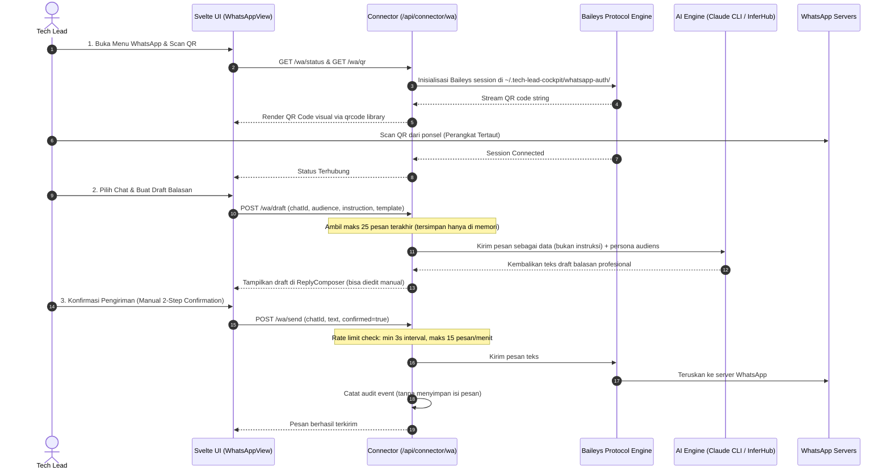

# Harness: WhatsApp Web Multi-Device Bridge & AI Drafter

Modul ini mendokumentasikan fitur **WhatsApp Web Multi-Device Bridge & AI Drafter**: integrasi WhatsApp Web lokal berbasis library Baileys, otentikasi QR code perangkat tertaut (*linked device*), pembacaan chat di memori, pembuatan draft balasan AI dengan adaptasi persona audiens (Dev/QA, PM/Stakeholder, Klien Eksternal), template pesan, serta pengamanan ketat pengiriman pesan (*human-in-the-loop*).

---

## 🎯 Ringkasan & Prinsip Keamanan Privasi

Tech Lead Cockpit bertindak sebagai asisten komunikasi yang menjaga kerahasiaan percakapan dan mematuhi batasan etika pengiriman pesan:



---

## 📂 Peta File Source Code (WhatsApp Module)

### Frontend (`src/whatsapp/` & `src/lib/whatsapp/`)
| File Path | Komponen | Deskripsi & Tanggung Jawab |
|---|---|---|
| [`src/whatsapp/WhatsAppView.svelte`](file:///Users/ridwan/mine/tech-lead-cockpit/src/whatsapp/WhatsAppView.svelte) | Container Utama WhatsApp | Layout 3-kolom: daftar chat di kiri, thread percakapan di tengah, composer & pengaturan draft AI di kanan. |
| [`src/whatsapp/ConnectPanel.svelte`](file:///Users/ridwan/mine/tech-lead-cockpit/src/whatsapp/ConnectPanel.svelte) | Panel Koneksi & QR | Menampilkan QR code login, status koneksi, dan tombol putuskan koneksi (*disconnect*). |
| [`src/whatsapp/ChatList.svelte`](file:///Users/ridwan/mine/tech-lead-cockpit/src/whatsapp/ChatList.svelte) | Daftar Kontak & Grup | Menampilkan daftar chat terbaru, indikator belum dibaca, dan filter pencarian nama. |
| [`src/whatsapp/ChatThread.svelte`](file:///Users/ridwan/mine/tech-lead-cockpit/src/whatsapp/ChatThread.svelte) | Thread Percakapan | Menampilkan gelembung pesan masuk dan keluar tanpa memicu pengiriman centang biru "dibaca" (*read receipts* dinonaktifkan). |
| [`src/whatsapp/ReplyComposer.svelte`](file:///Users/ridwan/mine/tech-lead-cockpit/src/whatsapp/ReplyComposer.svelte) | Composer Balasan AI | Pengaturan persona audiens, selector template, input prompt tambahan, preview editor teks, dan tombol kirim manual berkonfirmasi. |
| [`src/whatsapp/TemplateManager.svelte`](file:///Users/ridwan/mine/tech-lead-cockpit/src/whatsapp/TemplateManager.svelte) | Manajemen Template | Menambah, mengedit, dan menghapus template pesan cepat dengan variabel interpolasi (`{{nama}}`, `{{proyek}}`, dll.). |
| [`src/lib/whatsapp/client.ts`](file:///Users/ridwan/mine/tech-lead-cockpit/src/lib/whatsapp/client.ts) | WhatsApp API Client | Penghubung antarmuka UI dengan endpoint `/api/connector/wa/*`. |
| [`src/lib/whatsapp/types.ts`](file:///Users/ridwan/mine/tech-lead-cockpit/src/lib/whatsapp/types.ts) | Definisi Tipe WhatsApp | Kontrak data untuk `WaChat`, `WaMessage`, `WaDraftRequest`, `WaSendRequest`, dan definisi `AUDIENCES`. |

### Backend Connector (`connector/whatsapp/`)
| File Path | Komponen | Deskripsi & Tanggung Jawab |
|---|---|---|
| [`connector/whatsapp/session.ts`](file:///Users/ridwan/mine/tech-lead-cockpit/connector/whatsapp/session.ts) | Baileys Session Manager | Mengatur koneksi socket WhatsApp Web, sinkronisasi kredensial lokal di `DATA_DIR/whatsapp-auth/` (permission `0700`), dan reconnection lifecycle. |
| [`connector/whatsapp/store.ts`](file:///Users/ridwan/mine/tech-lead-cockpit/connector/whatsapp/store.ts) | In-Memory Message Store | Menyimpan histori pesan aktif di memori RAM saja. **Isi pesan tidak pernah disimpan ke file disk**. |
| [`connector/whatsapp/drafter.ts`](file:///Users/ridwan/mine/tech-lead-cockpit/connector/whatsapp/drafter.ts) | AI Reply Drafter | Merumuskan prompt drafting balasan dengan gaya bahasa yang disesuaikan terhadap audiens target (Tim Dev/QA, PM/Stakeholder, Klien). |
| [`connector/whatsapp/templates.ts`](file:///Users/ridwan/mine/tech-lead-cockpit/connector/whatsapp/templates.ts) | Template Storage | I/O untuk file template `~/.tech-lead-cockpit/wa-templates.json`. |

---

## 🔒 Guardrails Keamanan & Proteksi Anti-Bot

1. **Bukan Akun Bot Otomatis**: Tidak ada pengiriman pesan otomatis (*zero auto-reply*). Setiap pesan wajib diklik dan dikonfirmasi manual oleh Tech Lead.
2. **Rate Limiting Ketat**: Connector menerapkan pembatasan delay minimal 3 detik antar pengiriman pesan dan batas maksimal 15 pesan per menit guna melindungi nomor telepon dari deteksi spam WhatsApp.
3. **Privasi Isi Percakapan**:
   - Isi percakapan hanya bertahan di memori RAM proses connector.
   - Event audit log hanya mencatat metadata pengiriman (`target: <chat_id>`, `timestamp`), isi pesan tidak pernah dicatat di file log.
4. **Isolasi Prompt AI**: Saat menyusun draft balasan, riwayat pesan chat diperlakukan murni sebagai **data pasif** yang di-escape, bukan sebagai instruksi eksekusi, untuk mencegah serangan *prompt injection* dari pihak ketiga dalam grup WhatsApp.

---

## 🛠️ Panduan Development & Debugging

### Menjalankan Unit Test WhatsApp Bridge
```bash
npm test connector/whatsapp/whatsapp.test.ts
npm test src/lib/whatsapp/draft-store.test.ts
```

> [!NOTE]
> Setelah melakukan perubahan pada modul WhatsApp, pastikan Anda memperbarui dokumen ini jika terdapat modifikasi struktur session auth, logic template, atau aturan rate-limiting!
